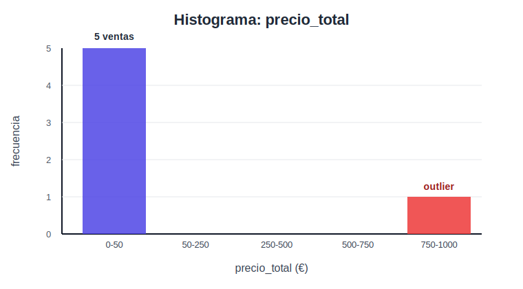
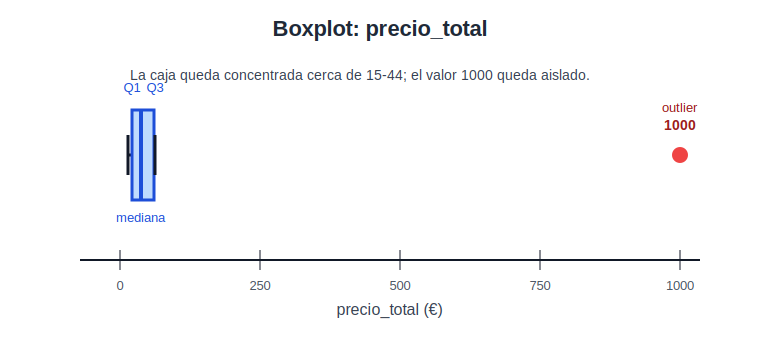
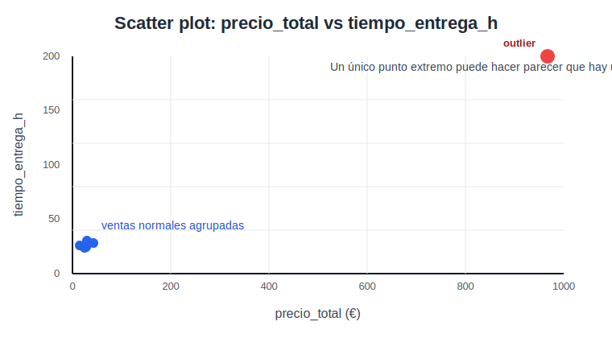

# UD1 · Parte 0 — Estadística aplicada para Big Data

## Propósito

Antes de limpiar datos, construir datasets, interpretar gráficos o entrenar modelos, necesitamos una base mínima de estadística aplicada.

No buscamos hacer matemáticas por hacer matemáticas. Buscamos entender los datos lo suficiente como para tomar buenas decisiones técnicas.

Esta parte ayuda a cubrir el **RA1** de Sistemas de Big Data, especialmente cuando habla de aplicar técnicas de análisis de datos, extraer información, construir datasets complejos y valorar calidad/coste de una solución.

## 1. Por qué estadística en Big Data

En Big Data no basta con cargar muchos datos. Hay que saber responder preguntas como:

- ¿Los datos tienen sentido?
- ¿Hay valores imposibles?
- ¿Hay variables muy relacionadas entre sí?
- ¿Hay datos sesgados?
- ¿Hay outliers que rompen el análisis?
- ¿Una gráfica muestra una relación real o sólo ruido?
- ¿Una variable aporta información o duplica otra?
- ¿La calidad del dataset permite tomar decisiones?

La estadística aplicada nos da herramientas para detectar estos problemas antes de construir dashboards, pipelines o modelos.

## 2. Tipos de variables

| Tipo | Ejemplos | Qué permite hacer |
| ---- | -------- | ----------------- |
| Numérica continua | temperatura, precio, peso, ingresos | medias, desviaciones, correlaciones, histogramas |
| Numérica discreta | nº de pedidos, nº de errores, nº de visitas | conteos, distribuciones, agregaciones |
| Categórica nominal | ciudad, producto, país, tipo de cliente | frecuencias, agrupaciones, segmentación |
| Categórica ordinal | bajo/medio/alto, nivel de riesgo | comparación ordenada, ranking |
| Temporal | fecha, hora, timestamp | series temporales, ventanas, tendencia |
| Texto/no estructurada | comentarios, logs, reseñas | extracción, clasificación, búsqueda |

Primera regla práctica: **no se visualiza ni se transforma igual una variable numérica que una categórica o temporal**.

## 3. Medidas básicas

Usaremos este mini-dataset durante la explicación:

| venta_id | ciudad | unidades | precio_total | tiempo_entrega_h |
| --- | --- | ---: | ---: | ---: |
| 1 | Cádiz | 2 | 24 | 24 |
| 2 | Cádiz | 1 | 15 | 26 |
| 3 | Sevilla | 3 | 30 | 30 |
| 4 | Sevilla | 4 | 44 | 28 |
| 5 | Málaga | 2 | 28 | 25 |
| 6 | Málaga | 1 | 1000 | 200 |

La última fila es sospechosa. Puede ser un error, una venta excepcional o un dato real pero raro. Justo por eso nos interesa analizarlo.

### Media

La media resume el valor promedio.

\[
\bar{x} = \frac{x_1 + x_2 + \dots + x_n}{n}
\]

Para `precio_total`:

\[
\bar{x} = \frac{24 + 15 + 30 + 44 + 28 + 1000}{6} = \frac{1141}{6} = 190{,}17
\]

Problema: es sensible a outliers.

Aquí la mayoría de ventas están entre 15 y 44 euros, pero la media sale 190,17 euros. Esa media **no representa una venta típica**.

### Mediana

La mediana es el valor central al ordenar los datos.

Datos ordenados de `precio_total`:

\[
15, 24, 28, 30, 44, 1000
\]

Como hay un número par de datos, la mediana es la media de los dos valores centrales:

\[
\text{mediana} = \frac{28 + 30}{2} = 29
\]

Suele ser más robusta cuando hay outliers.

En este caso, 29 euros describe mucho mejor el comportamiento normal que 190,17 euros.

### Moda

La moda es el valor más frecuente.

Es útil en variables categóricas.

### Desviación típica

Mide cuánto se dispersan los valores respecto a la media.

Para una muestra:

\[
s = \sqrt{\frac{\sum_{i=1}^{n}(x_i - \bar{x})^2}{n-1}}
\]

Una desviación alta indica datos muy variables; una desviación baja indica datos concentrados.

Idea importante: si hay outliers, la desviación típica también puede crecer mucho. Por eso no se interpreta sola.

### Percentiles

Un percentil indica la posición de un valor dentro de un conjunto de datos ordenado.

El percentil 80, por ejemplo, es un valor tal que aproximadamente el 80% de los datos queda por debajo o igual a él.

Forma de leerlo:

| Percentil | Interpretación |
| --- | --- |
| P10 | valor por debajo del cual queda aproximadamente el 10% de los datos |
| P50 | valor central; coincide con la mediana |
| P90 | valor por debajo del cual queda aproximadamente el 90% de los datos |

Ejemplo: si en un sistema de pedidos el P90 del tiempo de entrega es 48 horas, significa que aproximadamente el 90% de los pedidos se entrega en 48 horas o menos. El 10% restante tarda más.

Esto es especialmente útil en Big Data porque muchas veces interesa más una garantía de servicio que una media.

Comparación:

- media de entrega: 20 horas,
- P90 de entrega: 48 horas,
- P99 de entrega: 120 horas.

La media parece buena, pero el P99 revela que un pequeño porcentaje de casos tarda muchísimo.

### Cuartiles

Los cuartiles son percentiles concretos que dividen los datos ordenados en cuatro partes.

| Cuartil | Percentil equivalente | Qué indica |
| --- | --- | --- |
| Q1 | P25 | el 25% de los datos queda por debajo o igual |
| Q2 | P50 | mediana |
| Q3 | P75 | el 75% de los datos queda por debajo o igual |

Con nuestros datos ordenados:

\[
15, 24, 28, 30, 44, 1000
\]

Podemos leerlos de forma aproximada así:

- Q1 está alrededor de la parte baja del bloque central,
- Q2 es la mediana: 29,
- Q3 está alrededor de la parte alta del bloque central.

El detalle exacto puede variar ligeramente según el método de interpolación de la herramienta. Pandas, Spark, Excel o NumPy pueden calcular cuartiles con criterios algo distintos.

Lo importante para este módulo es saber interpretarlos: Q1 y Q3 describen la zona central de los datos sin dejarse dominar tanto por extremos.

### Rango e IQR

- Rango: máximo - mínimo.
- IQR: rango intercuartílico, distancia entre Q1 y Q3.

\[
\text{rango} = \max(x) - \min(x)
\]

\[
\text{IQR} = Q3 - Q1
\]

El IQR ayuda a detectar outliers de forma más robusta.

Intuición:

- el rango mira sólo el mínimo y el máximo,
- el IQR mira la parte central de la distribución,
- por eso el IQR suele ser más estable cuando hay valores extremos.

Para el ejemplo, el rango es:

\[
1000 - 15 = 985
\]

Ese número nos dice que hay mucha distancia entre mínimo y máximo, pero no explica si el problema está repartido por todos los datos o concentrado en un único valor extremo.

## 3.1 Medidas en Big Data: cálculo exacto y aproximado

En datasets pequeños podemos ordenar todos los valores y calcular mediana o percentiles exactos. En Big Data, ordenar todo puede ser caro.

Por eso muchas herramientas usan aproximaciones:

- percentiles aproximados,
- muestreo,
- sketches estadísticos,
- agregaciones por particiones.

La pregunta técnica no es sólo “qué medida calculo”, sino también “cuánto cuesta calcularla”.

Ejemplo con Spark:

```python
df.approxQuantile('precio_total', [0.25, 0.5, 0.75], 0.01)
```

Ese código pide Q1, mediana y Q3 con error relativo aproximado del 1%. En millones de filas puede ser más viable que ordenar todos los datos.

## 4. Distribuciones

Una distribución describe cómo se reparten los valores de una variable.

Preguntas útiles:

- ¿Los datos están concentrados o dispersos?
- ¿Hay una cola larga?
- ¿Hay varios grupos?
- ¿Hay valores extremos?
- ¿La variable parece normal, sesgada o irregular?

Visualizaciones típicas:

- Histograma.
- Boxplot.
- Curva de densidad.
- Barras de frecuencia.

### Histograma del ejemplo



Lectura:

- cinco ventas están concentradas entre 0 y 50 euros,
- una venta aparece aislada cerca de 1000 euros,
- la distribución no es simétrica,
- usar sólo la media sería engañoso.

## 5. Outliers

Un outlier es un valor extremo respecto al resto.

No siempre es un error.

Puede ser:

- un dato mal introducido,
- una unidad incorrecta,
- un caso raro pero real,
- una señal de fraude,
- un evento especial,
- una oportunidad de análisis.

Regla importante: **no se borran outliers sin justificar**.

### Regla IQR para detectar outliers

Una regla habitual es marcar como sospechosos los valores fuera de estos límites:

\[
\text{límite inferior} = Q1 - 1{,}5 \cdot IQR
\]

\[
\text{límite superior} = Q3 + 1{,}5 \cdot IQR
\]

Si `precio_total = 1000` queda por encima del límite superior, no significa automáticamente “borrar”. Significa “investigar”.

### Boxplot del ejemplo



Lectura:

- la caja concentra la zona habitual de los datos,
- la mediana queda cerca de las ventas normales,
- el punto rojo queda separado como valor extremo,
- el gráfico ayuda a explicar por qué la media no representa bien el caso.

Decisiones posibles:

| Situación | Decisión razonable |
| --- | --- |
| Error de captura | corregir si se conoce el valor correcto |
| Unidad incorrecta | convertir unidades y documentar |
| Caso real extremo | conservar y etiquetar |
| Fraude o evento especial | analizar por separado |
| Valor imposible | eliminar sólo con justificación |

Antes de actuar:

1. Detectar.
2. Entender.
3. Decidir.
4. Documentar.

## 6. Correlación

La correlación mide la relación entre dos variables numéricas.

La correlación de Pearson se define como:

\[
r = \frac{\sum_{i=1}^{n}(x_i - \bar{x})(y_i - \bar{y})}{(n-1)s_xs_y}
\]

Donde:

- \(x_i\) e \(y_i\) son los valores de cada variable,
- \(\bar{x}\) y \(\bar{y}\) son sus medias,
- \(s_x\) y \(s_y\) son sus desviaciones típicas.

Valores típicos:

| Correlación | Interpretación aproximada |
| ----------- | ------------------------- |
| Cerca de 1 | relación positiva fuerte |
| Cerca de -1 | relación negativa fuerte |
| Cerca de 0 | poca relación lineal |

Ejemplo:

- Si aumenta la inversión publicitaria y aumentan las ventas, puede haber correlación positiva.
- Si aumenta el tiempo de carga de una web y baja la conversión, puede haber correlación negativa.

Pero cuidado:

> Correlación no implica causalidad.

Dos variables pueden estar relacionadas por casualidad o por una tercera variable oculta.

Ejemplo con el mini-dataset:

- `precio_total = 1000` coincide con `tiempo_entrega_h = 200`.
- Esto puede disparar la correlación entre precio y tiempo de entrega.
- Pero no demuestra que “los pedidos caros tardan más”. Puede ser un único evento anómalo.

### Scatter plot del ejemplo



Lectura:

- la mayoría de puntos están agrupados abajo a la izquierda,
- un único punto extremo domina la interpretación visual,
- antes de hablar de relación entre variables hay que revisar outliers y contexto.

Por eso una correlación siempre debe revisarse con:

1. scatter plot,
2. contexto del negocio,
3. detección de outliers,
4. tamaño de muestra,
5. posible variable oculta.

## 7. Scatter plots

Un scatter plot muestra puntos para comparar dos variables numéricas.

Sirve para ver:

- relaciones lineales,
- relaciones no lineales,
- grupos,
- outliers,
- patrones raros,
- dispersión.

Preguntas para interpretar un scatter plot:

- ¿Los puntos suben o bajan?
- ¿Hay forma clara o sólo nube?
- ¿Hay grupos separados?
- ¿Hay puntos aislados?
- ¿La relación parece lineal?
- ¿Puede haber una variable externa explicando el patrón?

## 8. Colinealidad

Hay colinealidad cuando dos o más variables explican casi lo mismo.

Ejemplo:

- `precio_total`
- `precio_sin_iva`
- `iva`

Relación matemática:

\[
\text{precio total} = \text{precio sin IVA} + \text{IVA}
\]

O también:

\[
\text{precio total} = \text{unidades} \cdot \text{precio unitario}
\]

O:

- `metros_cuadrados`
- `numero_habitaciones`

Problema:

- Puede confundir modelos.
- Puede duplicar información.
- Puede hacer que una explicación parezca más sólida de lo que es.

En limpieza y preparación de datos, conviene detectar variables redundantes.

En un modelo predictivo, incluir `precio_total`, `unidades` y `precio_unitario` puede introducir información duplicada. En un pipeline de calidad, en cambio, esa relación es útil para validar datos:

```text
SI precio_total != unidades * precio_unitario
ENTONCES registro inconsistente
```

La misma relación puede ser ruido para un modelo y una regla excelente para validar calidad. Ese matiz importa.

## 9. Sesgo

Un dataset está sesgado cuando no representa bien la realidad que pretende estudiar.

Ejemplos:

- Sólo hay datos de clientes de una ciudad.
- Faltan datos de ciertos meses.
- Hay más registros de un tipo de usuario que de otro.
- Los datos vienen de una fuente con comportamiento especial.

El sesgo puede hacer que un dashboard o modelo parezca correcto pero tome malas decisiones.

## 10. Calidad de datos

Dimensiones habituales:

| Dimensión | Pregunta |
| --------- | -------- |
| Completitud | ¿Faltan datos? |
| Validez | ¿Los valores cumplen reglas esperadas? |
| Consistencia | ¿Los datos coinciden entre fuentes? |
| Unicidad | ¿Hay duplicados? |
| Actualidad | ¿Los datos están actualizados? |
| Precisión | ¿Reflejan la realidad con suficiente exactitud? |

Estas dimensiones conectan directamente con limpieza, integración y construcción de datasets complejos.

### Métricas simples de calidad

Completitud de una columna:

\[
\text{completitud} = 1 - \frac{\text{nulos}}{\text{total de registros}}
\]

Unicidad de una clave:

\[
\text{unicidad} = \frac{\text{valores distintos}}{\text{total de registros}}
\]

Tasa de validez de una regla:

\[
\text{validez} = \frac{\text{registros que cumplen la regla}}{\text{total de registros}}
\]

Ejemplo: si 970 de 1000 registros tienen `precio_total = unidades * precio_unitario`, la validez de esa regla es:

\[
\frac{970}{1000} = 0{,}97 = 97\%
\]

Esto permite comparar calidad entre datasets o entre versiones del pipeline.

## 11. Relación con Big Data

En datasets pequeños, un error puede detectarse a ojo.

En Big Data, eso no escala.

Por eso necesitamos:

- métricas automáticas,
- validaciones,
- perfiles de datos,
- dashboards de calidad,
- reglas reproducibles,
- documentación de decisiones.

La estadística aplicada no es un añadido teórico: es una herramienta para no construir sistemas Big Data sobre basura.

## 12. Checklist de análisis inicial

Antes de usar un dataset:

- [ ] Identifico tipos de variables.
- [ ] Calculo medidas básicas.
- [ ] Reviso nulos.
- [ ] Reviso duplicados.
- [ ] Reviso outliers.
- [ ] Analizo distribuciones.
- [ ] Compruebo correlaciones relevantes.
- [ ] Busco colinealidad.
- [ ] Reviso posibles sesgos.
- [ ] Documento decisiones de limpieza.

## 13. Qué debe saber explicar el alumnado

Al terminar esta parte, el alumnado debe poder explicar:

- qué tipo de variables tiene un dataset,
- qué medidas resumen mejor cada variable,
- qué muestra un histograma,
- cómo interpretar un boxplot,
- cómo leer un scatter plot,
- qué significa correlación,
- por qué correlación no implica causalidad,
- qué es colinealidad,
- qué problemas de calidad existen,
- qué decisiones de limpieza aplicaría y por qué.

## 14. Ejemplo con código

El ejemplo [Estadística aplicada con Python](../../02-ejemplos/UD1_Ejemplo_Estadistica_Python.md) reproduce estos cálculos con `pandas`.

La idea no es copiar el código, sino comprobar que cada fórmula tiene una traducción directa a una operación técnica:

| Concepto | Fórmula/idea | Código típico |
| --- | --- | --- |
| Media | \(\bar{x}\) | `mean()` |
| Mediana | valor central | `median()` |
| Desviación típica | \(s\) | `std()` |
| Cuartiles | Q1, Q2, Q3 | `quantile()` |
| IQR | \(Q3 - Q1\) | `q3 - q1` |
| Correlación | \(r\) de Pearson | `corr()` |

Si no puedes explicar qué calcula cada línea, todavía no estás usando estadística: estás ejecutando instrucciones sin comprenderlas. En Big Data, eso puede llevar a decisiones técnicas incorrectas.
