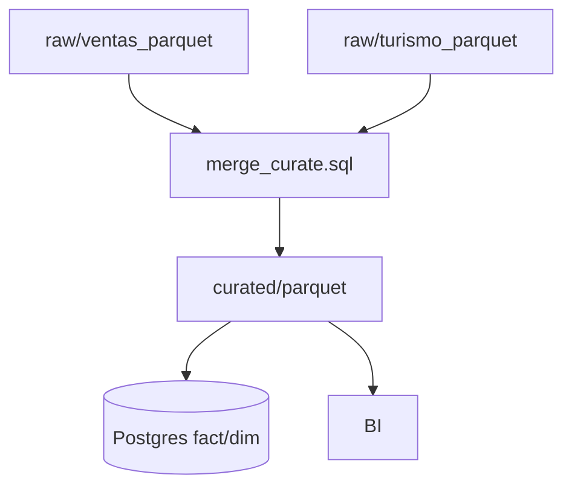

# UD2 · Integración y calidad incremental (joins + upsert)

> Objetivo: consolidar turismo (CSV→Parquet) y ventas (API→Parquet) en un **curado** común, con **calidad** y **upsert** hacia Postgres o Parquet particionado.

## 1) Integración rápida con DuckDB (sobre Parquet)
```sql
-- integrate/merge_curate.sql
CREATE OR REPLACE TABLE curated AS
SELECT
  s.fecha::DATE AS fecha,
  s.tienda_id,
  s.sku,
  s.unidades,
  s.importe,
  t.visitantes_municipio,
  t.visitantes_total
FROM 'data_lake/raw/ventas_parquet/*.parquet' s
LEFT JOIN 'data_lake/raw/turismo_parquet/*.parquet' t
ON s.fecha = t.fecha AND s.municipio_id = t.municipio_id;
```

## 2) Reglas de calidad (mínimo viable)
- **Dominio:** `canal ∈ {'tienda','web','app'}`  
- **Rango:** `0 ≤ unidades ≤ 500`  
- **Consistencia:** `importe ≈ unidades*precio` (±2%)  
- **Puntualidad:** registros del **último mes** presentes.

```sql
SELECT
  AVG(canal IN ('tienda','web','app')) AS dom_ok,
  AVG(unidades BETWEEN 0 AND 500) AS rango_ok,
  AVG(ABS(importe - unidades*precio) <= GREATEST(0.01, 0.02*(unidades*precio))) AS cons_ok
FROM curated;
```

## 3) Upsert (idempotencia)
**Hacia Postgres (pseudo-SQL):**
```sql
INSERT INTO fact_ventas AS f (fecha, tienda_id, sku, unidades, importe)
SELECT fecha, tienda_id, sku, unidades, importe FROM staging_fact
ON CONFLICT (fecha, tienda_id, sku) DO UPDATE
SET unidades = EXCLUDED.unidades,
    importe = EXCLUDED.importe;
```

**Hacia Parquet (estrategia simple):**
- Reescribir particiones afectadas (`anio/mes`) tras merge en DuckDB.
- Mantener `manifest` de particiones tocadas (archivo `.txt`).

## 4) Linaje (mermaid)

