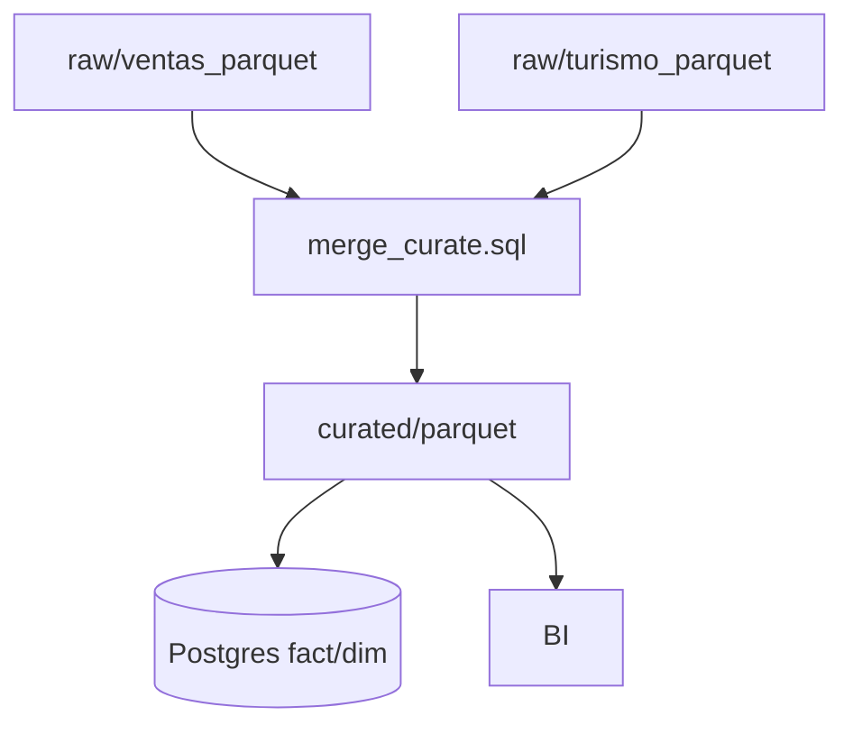

# UD2 — Ingesta e Integración de Datos en Sistemas de Big Data


<!-- 001-AlmacenamientoDeDatos.md -->

### **Introducción al Almacenamiento en Big Data**

El almacenamiento en Big Data es un componente esencial para gestionar y procesar grandes volúmenes de información de manera eficiente. Los datos generados por organizaciones modernas crecen exponencialmente debido a fuentes como redes sociales, IoT, aplicaciones empresariales y logs de sistemas. Este crecimiento plantea desafíos significativos, tanto en términos de infraestructura como de gestión de los datos, que requieren soluciones escalables, rápidas y seguras.

A continuación, se presentan los conceptos fundamentales, los retos principales y las soluciones más comunes en almacenamiento en Big Data.

---

### **Conceptos Fundamentales del Almacenamiento en Big Data**

#### **1. Tipos de Almacenamiento**
El almacenamiento de datos en Big Data se organiza típicamente en tres categorías principales: **almacenamiento por bloques**, **almacenamiento de archivos** y **almacenamiento de objetos**. Cada uno tiene características específicas diseñadas para diferentes escenarios.

---

#### **1.1 Almacenamiento por Bloques**
- **Descripción:**
  - Divide los datos en bloques de tamaño fijo (generalmente de 4 KB a 1 MB) y los almacena en discos físicos. Cada bloque tiene un identificador único que permite acceder a él de manera directa.
  - Común en discos duros tradicionales y en sistemas de almacenamiento SAN (Storage Area Network).

- **Características:**
  - Alto rendimiento en acceso aleatorio.
  - Ideal para bases de datos y aplicaciones que necesitan escribir y leer datos rápidamente.

- **Usos:**
  - Bases de datos relacionales.
  - Sistemas de alto rendimiento como VMware o entornos de virtualización.

- **Ejemplo de Soluciones:**
  - Amazon EBS (Elastic Block Store).
  - Azure Disk Storage.
  - Google Persistent Disk.

---

#### **1.2 Almacenamiento de Archivos**
- **Descripción:**
  - Los datos se organizan en un sistema de directorios y subdirectorios con una estructura jerárquica. Los usuarios acceden a los archivos utilizando nombres de ruta.
  - Es un método más tradicional y es ampliamente utilizado en servidores de archivos locales.

- **Características:**
  - Estructura fácil de entender para usuarios finales.
  - Eficiente en entornos pequeños donde los datos son accedidos en grupos o como archivos completos.

- **Usos:**
  - Servidores de almacenamiento compartido (SMB o NFS).
  - Aplicaciones empresariales con necesidades de colaboración.
  - Almacenamiento de documentos, imágenes o multimedia.

- **Ejemplo de Soluciones:**
  - Azure Files.
  - Amazon FSx.
  - Google Filestore.

---

#### **1.3 Almacenamiento de Objetos**
- **Descripción:**
  - Diseñado para manejar grandes volúmenes de datos no estructurados. Los datos se almacenan como "objetos", cada uno con metadatos asociados y un identificador único.
  - Los objetos no tienen jerarquías; todos los datos están en un espacio plano.

- **Características:**
  - Escalabilidad prácticamente ilimitada.
  - Acceso basado en API, optimizado para aplicaciones en la nube y Big Data.
  - Costos bajos en comparación con otros métodos.

- **Usos:**
  - Copias de seguridad.
  - Archivos multimedia.
  - Datos no estructurados, como logs de servidores o datos de IoT.

- **Ejemplo de Soluciones:**
  - Amazon S3.
  - Google Cloud Storage.
  - Azure Blob Storage.

---

### **Retos Principales del Almacenamiento en Big Data**

1. **Volumen y Escalabilidad:**
   - Los datos crecen rápidamente, lo que requiere sistemas de almacenamiento capaces de escalar horizontalmente (agregar más nodos) para adaptarse a la demanda.

2. **Variedad de Datos:**
   - Big Data abarca datos estructurados, semi-estructurados y no estructurados. Esto complica su almacenamiento y recuperación.

3. **Velocidad de Acceso:**
   - Las aplicaciones modernas necesitan procesar datos en tiempo real o casi en tiempo real, lo que requiere almacenamiento de alto rendimiento.

4. **Durabilidad y Disponibilidad:**
   - La pérdida de datos puede tener consecuencias graves. Es crucial garantizar durabilidad (almacenamiento redundante) y disponibilidad (acceso constante).

5. **Costos:**
   - Mantener grandes volúmenes de datos puede ser costoso, especialmente en soluciones en la nube o sistemas altamente redundantes.

6. **Seguridad:**
   - Los datos deben estar protegidos contra accesos no autorizados y cumplir con normativas como GDPR o HIPAA.

---

### **Soluciones Comunes al Almacenamiento en Big Data**

1. **Sistemas Distribuidos:**
   - Utilizan múltiples nodos para almacenar datos de manera redundante, asegurando alta disponibilidad y tolerancia a fallos.
   - Ejemplo: Hadoop Distributed File System (HDFS).

2. **Almacenamiento en la Nube:**
   - Proveedores como AWS, Azure y Google Cloud ofrecen servicios escalables y flexibles, con opciones específicas para cada necesidad de Big Data.
   - Ejemplo: Amazon S3 para almacenamiento de objetos, Azure Blob Storage y Google Cloud Storage.

3. **Compresión y Optimización:**
   - Para reducir costos y mejorar el rendimiento, se aplican técnicas como compresión de datos, deduplicación y almacenamiento jerárquico.

4. **Automatización y Gestión:**
   - Herramientas como Apache Hive y AWS Glue facilitan la organización y gestión de grandes conjuntos de datos.

---

### **Resumen**

El almacenamiento en Big Data requiere una combinación de soluciones que puedan manejar grandes volúmenes de datos con diferentes formatos, garantizar la seguridad y durabilidad, y ofrecer un costo razonable. Los tres tipos principales de almacenamiento (bloques, archivos y objetos) juegan roles importantes dependiendo de las necesidades específicas de las aplicaciones. Las soluciones modernas, como los sistemas distribuidos y el almacenamiento en la nube, han sido fundamentales para abordar los retos del almacenamiento en Big Data, permitiendo a las organizaciones aprovechar al máximo sus datos para generar valor.

<!-- 002-AlmacenamientoDistribuido.md -->

### **Sistemas de Almacenamiento Distribuido**

El almacenamiento distribuido es una pieza clave en la gestión de datos en Big Data. Este enfoque distribuye datos a través de múltiples nodos o servidores, garantizando escalabilidad, tolerancia a fallos y un rendimiento eficiente en el manejo de grandes volúmenes de datos. A continuación, exploraremos los sistemas de almacenamiento distribuido más relevantes, incluyendo **HDFS**, **Amazon S3**, **Google Cloud Storage**, y **Azure Blob Storage**.

---

### **¿Qué es el almacenamiento distribuido?**

El almacenamiento distribuido divide los datos en fragmentos y los almacena en múltiples máquinas que trabajan juntas para simular un único sistema de almacenamiento. Este diseño ofrece:

1. **Escalabilidad Horizontal:** Permite agregar más nodos para manejar el crecimiento de los datos.
2. **Tolerancia a Fallos:** Si un nodo falla, los datos aún están disponibles desde otros nodos redundantes.
3. **Eficiencia:** Optimiza el uso de recursos y reduce los cuellos de botella al dividir las cargas entre nodos.
4. **Durabilidad:** Asegura que los datos estén disponibles incluso en caso de fallos físicos.

---

### **1. HDFS (Hadoop Distributed File System)**

HDFS es el sistema de almacenamiento distribuido más emblemático en el ecosistema de Big Data. Fue desarrollado como parte de Apache Hadoop y diseñado específicamente para almacenar y procesar grandes volúmenes de datos.

#### **Características Clave:**
- **Alto Rendimiento:**
  - Optimizado para leer y escribir grandes conjuntos de datos de forma secuencial.
- **Escalabilidad:**
  - Diseñado para crecer horizontalmente añadiendo más nodos al clúster.
- **Replicación:**
  - Cada bloque de datos se replica (por defecto, tres veces) en nodos diferentes para garantizar durabilidad y disponibilidad.
- **Compatibilidad:**
  - Funciona con otras herramientas del ecosistema Hadoop, como Apache Hive, Apache Pig y Spark.

#### **Arquitectura:**
1. **NameNode:**
   - Coordina el clúster y administra la información de metadatos (ubicación de bloques, permisos).
2. **DataNodes:**
   - Almacenan los bloques de datos y se comunican con el NameNode para mantener la coherencia.

#### **Casos de Uso:**
- Almacenamiento de datos para procesamiento analítico masivo.
- Gestión de datos históricos en aplicaciones empresariales.

---

### **2. Amazon S3 (Simple Storage Service)**

Amazon S3 es un servicio de almacenamiento de objetos en la nube ofrecido por AWS. Es altamente escalable y está diseñado para almacenar y acceder a grandes cantidades de datos no estructurados.

#### **Características Clave:**
- **Almacenamiento de Objetos:**
  - Los datos se almacenan como objetos con metadatos únicos en un espacio de nombres plano.
- **Escalabilidad Automática:**
  - Sin necesidad de gestionar servidores o infraestructura.
- **Durabilidad y Disponibilidad:**
  - Diseñado para ofrecer **99.999999999% (11 nueves)** de durabilidad y **99.99%** de disponibilidad.
- **Integración:**
  - Compatible con otras herramientas de AWS, como Lambda, Redshift y Athena.

#### **Clases de Almacenamiento:**
1. **S3 Standard:** Para datos a los que se accede frecuentemente.
2. **S3 Intelligent-Tiering:** Ajusta automáticamente entre clases basadas en patrones de acceso.
3. **S3 Glacier:** Para archivado de datos a largo plazo.

#### **Casos de Uso:**
- Almacenamiento de datos multimedia.
- Copias de seguridad y recuperación ante desastres.
- Almacenamiento de datos de Big Data para análisis con herramientas como Amazon EMR.

---

### **3. Google Cloud Storage**

Google Cloud Storage es el servicio de almacenamiento de objetos de Google Cloud Platform (GCP). Ofrece una solución escalable y duradera para almacenar datos estructurados y no estructurados.

#### **Características Clave:**
- **Almacenamiento Multiregión:**
  - Permite almacenar datos en múltiples regiones para mayor redundancia.
- **Modelo de Consistencia Fuerte:**
  - Garantiza que los datos son consistentes inmediatamente después de escribirlos.
- **Integración con BigQuery:**
  - Los datos almacenados en Cloud Storage pueden analizarse directamente en BigQuery.

#### **Clases de Almacenamiento:**
1. **Standard Storage:** Para datos de acceso frecuente.
2. **Nearline Storage:** Datos a los que se accede menos de una vez al mes.
3. **Coldline Storage:** Datos a los que se accede menos de una vez al año.
4. **Archive Storage:** Para archivado de datos a largo plazo.

#### **Casos de Uso:**
- Almacenamiento de datos de IoT.
- Análisis de datos de logs.
- Archivos multimedia distribuidos globalmente.

---

### **4. Azure Blob Storage**

Azure Blob Storage es el sistema de almacenamiento de objetos de Microsoft Azure, diseñado para manejar grandes cantidades de datos no estructurados.

#### **Características Clave:**
- **Optimización para Objetos:**
  - Ideal para datos no estructurados como imágenes, vídeos, archivos de registro y backups.
- **Escalabilidad:**
  - Al igual que S3 y Google Cloud Storage, se escala automáticamente según las necesidades.
- **Niveles de Almacenamiento:**
  - **Hot Access Tier:** Para datos de acceso frecuente.
  - **Cool Access Tier:** Datos que se usan poco frecuentemente.
  - **Archive Tier:** Para archivado de datos a largo plazo.

#### **Integraciones:**
- Compatible con herramientas de análisis como Azure Synapse Analytics.
- Soporte nativo para redes de entrega de contenido (CDN).

#### **Casos de Uso:**
- Copias de seguridad empresariales.
- Almacenamiento de grandes volúmenes de datos de aplicaciones web.
- Datos de analítica en tiempo real.

---

### **Comparación de los Sistemas de Almacenamiento Distribuido**

| **Sistema**           | **Tipo de Almacenamiento** | **Escalabilidad** | **Tolerancia a Fallos** | **Integración**           | **Costo**                  |
|------------------------|---------------------------|-------------------|--------------------------|---------------------------|---------------------------|
| HDFS                  | Archivos                 | Alta              | Alta (replicación)       | Ecosistema Hadoop         | Menor (infraestructura propia) |
| Amazon S3             | Objetos                 | Muy alta          | Muy alta                 | AWS (Lambda, Athena, etc.)| Moderado                  |
| Google Cloud Storage  | Objetos                 | Muy alta          | Muy alta                 | GCP (BigQuery, Dataflow)  | Moderado                  |
| Azure Blob Storage    | Objetos                 | Muy alta          | Muy alta                 | Azure (Synapse, Data Lake)| Moderado                  |

---

### **Conclusión**

Los sistemas de almacenamiento distribuido son esenciales en Big Data para manejar los crecientes volúmenes de información de manera eficiente y segura. HDFS sigue siendo una solución clave en entornos on-premises, mientras que Amazon S3, Google Cloud Storage y Azure Blob Storage dominan los entornos en la nube con su flexibilidad y escalabilidad. La elección entre estas soluciones depende de las necesidades específicas del negocio, incluyendo costos, integración con herramientas existentes y requisitos de redundancia y durabilidad.

<!-- 002-AlmacenamientoDistribuido-HDFS.md -->

### **Introducción a HDFS (Hadoop Distributed File System)**

El **Hadoop Distributed File System (HDFS)** es el sistema de archivos distribuido central del ecosistema Hadoop, diseñado específicamente para almacenar y procesar grandes volúmenes de datos en un entorno distribuido. Este sistema es fundamental en aplicaciones de Big Data, ya que permite manejar datos a escala de terabytes o petabytes de manera eficiente y fiable.

---

### **Características Clave de HDFS**

1. **Almacenamiento Distribuido**:
   - Los datos se dividen en bloques grandes (por defecto, 128 MB o más) que se distribuyen entre múltiples nodos dentro de un clúster.
   - Esta fragmentación permite que el procesamiento de los datos sea paralelizado, optimizando el rendimiento.

2. **Alta Disponibilidad y Tolerancia a Fallos**:
   - Cada bloque de datos se replica en varios nodos (por defecto, tres réplicas) para garantizar la disponibilidad incluso si un nodo falla.
   - Si un nodo que almacena datos falla, HDFS puede recuperar los datos de otros nodos donde se hayan replicado.

3. **Optimizado para Acceso Secuencial**:
   - Diseñado para leer y procesar grandes volúmenes de datos de manera secuencial en lugar de accesos aleatorios.
   - Esto lo hace ideal para aplicaciones que requieren análisis masivo, como el procesamiento de logs o análisis de datos transaccionales.

4. **Escalabilidad Horizontal**:
   - Se pueden añadir nodos al clúster para aumentar la capacidad de almacenamiento y procesamiento, sin necesidad de reconfiguraciones complejas.

5. **Integración con Ecosistemas Big Data**:
   - HDFS es compatible con herramientas como Apache Spark, Hive, Pig y HBase, lo que permite realizar análisis y consultas distribuidas.

---

### **Arquitectura de HDFS**

1. **NameNode (Nodo Maestro)**:
   - Es el componente principal que gestiona el metadato del sistema de archivos (ubicación de bloques, estructura de directorios, permisos, etc.).
   - Supervisa la disponibilidad de los nodos de datos, reparando automáticamente la pérdida de réplicas.

2. **DataNodes (Nodos de Datos)**:
   - Almacenan los bloques de datos reales distribuidos en todo el clúster.
   - Ejecutan operaciones de lectura y escritura bajo la dirección del NameNode.

3. **Secondary NameNode**:
   - Realiza copias periódicas del metadato del NameNode para asegurar la recuperación rápida en caso de fallo.

4. **Cliente HDFS**:
   - Los usuarios o aplicaciones interactúan con el NameNode para obtener información de ubicación de datos y se conectan a los DataNodes para leer o escribir los bloques.

---

### **Ventajas de HDFS**

- **Alta Fiabilidad**: Gracias a su sistema de replicación, los datos permanecen accesibles incluso si varios nodos fallan.
- **Escalabilidad**: Adecuado para entornos de Big Data en constante crecimiento.
- **Rendimiento Elevado**: Optimizado para el procesamiento paralelo de grandes conjuntos de datos.
- **Compatibilidad**: Integración fluida con herramientas analíticas y de procesamiento de datos como Spark y MapReduce.

---

### **Limitaciones de HDFS**

1. **No diseñado para datos pequeños**:
   - Maneja grandes archivos eficientemente, pero puede ser ineficiente para almacenar grandes cantidades de archivos pequeños debido al uso intensivo de metadatos.

2. **Latencia de Acceso**:
   - Optimizado para accesos secuenciales en lugar de aleatorios, lo que puede no ser ideal para aplicaciones OLTP (Procesamiento de Transacciones en Línea).

3. **Requiere Configuración Compleja**:
   - Configurar y administrar un clúster de HDFS requiere conocimientos técnicos avanzados.

---

### **Casos de Uso de HDFS**

1. **Procesamiento de Logs y Eventos**:
   - Ideal para almacenar y analizar grandes volúmenes de logs generados por servidores, aplicaciones o dispositivos IoT.

2. **Almacenamiento de Datos Empresariales**:
   - Empresas que manejan grandes volúmenes de datos transaccionales o de clientes.

3. **Análisis de Datos en la Nube**:
   - Almacenamiento de datos para aplicaciones de machine learning y análisis predictivo utilizando herramientas como Spark o Hive.

4. **Proyectos de Ciencia de Datos**:
   - Ofrece un repositorio centralizado para datos estructurados y no estructurados.

---

### **Conclusión**

HDFS es una solución poderosa y eficiente para el almacenamiento y procesamiento de datos en entornos distribuidos. Su diseño robusto y escalable lo convierte en una piedra angular para aplicaciones de Big Data, permitiendo que las organizaciones almacenen, gestionen y analicen datos masivos de manera fiable y económica.
### **Actividad en Clase: Usar HDFS con PySpark en AWS**

#### **Título de la Actividad:** Exploración Práctica de HDFS con PySpark en AWS

#### **Duración Aproximada:** 2-3 horas

#### **Objetivo:**
Introducir a los estudiantes al uso de **HDFS** (Hadoop Distributed File System) en un clúster de **Amazon EMR**, integrándolo con **PySpark** para cargar, procesar y guardar datos. Esta actividad práctica los guiará paso a paso mientras aprenden los fundamentos de almacenamiento distribuido y procesamiento paralelo.

---

### **Plan de Actividad**

#### **Introducción (20 minutos):**
1. Explica los conceptos básicos de HDFS:
   - Qué es HDFS y cómo funciona.
   - Importancia del almacenamiento distribuido en Big Data.
   - Rol de HDFS en entornos Hadoop y su integración con herramientas como PySpark.
2. Presenta Amazon EMR:
   - ¿Qué es EMR?
   - Cómo permite ejecutar Hadoop y Spark en AWS.
   - Introduce el entorno del Learner Lab de AWS Academy.

**Material de Apoyo:** Diapositivas con conceptos clave y diagramas del flujo de datos en HDFS.

---

### **Parte Práctica (2 horas)**

#### **Paso 1: Acceso al Learner Lab (15 minutos)**
1. Inicia sesión en AWS Academy Learner Lab:
   - Proporciona credenciales temporales generadas por el lab.
2. Instruye a los estudiantes a iniciar su entorno seleccionando **Start Lab** y a copiar las credenciales para iniciar sesión en AWS.

**Objetivo:** Garantizar que todos los estudiantes estén conectados al entorno AWS.

---

#### **Paso 2: Configuración de un Clúster EMR con HDFS (30 minutos)**
1. Dirige a los estudiantes al servicio **EMR**:
   - En la consola AWS, escribe "EMR" en la barra de búsqueda y selecciona el servicio.
2. Configuración básica del clúster:
   - Selecciona **Create cluster**.
   - Configura el clúster con:
     - **Release Version:** emr-6.9.0 o similar.
     - **Aplicaciones:** Seleccionar **Hadoop** y **Spark**.
     - **Instancias:** 1 nodo maestro y 2 nodos trabajadores (por defecto, `m5.xlarge`).
3. Inicia el clúster:
   - Haz clic en **Create cluster** y espera a que el estado cambie a **Running**.

**Objetivo:** Configurar un clúster funcional con HDFS habilitado.

---

#### **Paso 3: Acceso y Configuración de HDFS (20 minutos)**
1. Conectar al clúster:
   - Proporciona el comando SSH para conectar al nodo maestro desde la terminal.
   - Ejemplo de comando:
     ```bash
     ssh -i key.pem hadoop@<master-node-dns>
     ```
Con otras herramientas de AWS lo he conseguido desde mi ordenador, con esta sólo he conseguido conectar 
desde cloudshell.

2. Crear un directorio en HDFS:
   - Usar el comando:
     ```bash
     hdfs dfs -mkdir /user/data
     ```
3. Subir archivos a HDFS:
   - Proporciona un archivo de datos pequeño para cargar en HDFS (por ejemplo, `local_file.csv`).
   - Comando para subir el archivo:
     ```bash
     hdfs dfs -put local_file.csv /user/data/
     ```
4. Verificar el contenido del directorio:
   - Comando:
     ```bash
     hdfs dfs -ls /user/data/
     ```

**Objetivo:** Enseñar los comandos básicos para interactuar con HDFS.

---

#### **Paso 4: Uso de PySpark con HDFS (40 minutos)**
1. Iniciar el shell de PySpark:
   - Comando:
     ```bash
     pyspark
     ```
2. Leer datos desde HDFS:
   - Código:
     ```python
     df = spark.read.csv("hdfs:///user/data/local_file.csv", header=True)
     df.show()
     ```
3. Procesar los datos:
   - Ejemplo: Filtrar filas según una condición:
     ```python
     filtered_df = df.filter(df['column_name'] > 100)
     filtered_df.show()
     ```
4. Guardar los resultados en HDFS:
   - Código:
     ```python
     filtered_df.write.csv("hdfs:///user/data/output.csv")
     ```

**Objetivo:** Realizar operaciones básicas de lectura, procesamiento y escritura de datos con PySpark en HDFS.

---

### **Cierre y Discusión (30 minutos)**
1. Repasa las actividades realizadas y discute:
   - ¿Qué dificultades encontraron?
   - ¿Cómo HDFS y PySpark ayudan en el procesamiento distribuido?
   - Casos prácticos donde estas herramientas podrían ser útiles.
2. Presenta ejemplos más avanzados para que los estudiantes continúen explorando:
   - Procesamiento en tiempo real con Spark Streaming.
   - Comparación de formatos de datos en HDFS.

---

### **Material Necesario**
1. Un archivo de datos de ejemplo para cargar en HDFS (puede ser un archivo CSV con datos ficticios).
2. Guía impresa o digital con comandos básicos de HDFS y PySpark.
3. Presentación introductoria con conceptos teóricos.

---

### **Evaluación**
Los estudiantes serán evaluados con base en:
- **Participación Activa:** Seguimiento de las instrucciones y ejecución de los pasos.
- **Configuración Correcta del Clúster EMR:** HDFS funcional con datos cargados.
- **Uso de PySpark:** Lectura, procesamiento y escritura de datos sin errores.
- **Reflexión Final:** Capacidad para identificar las ventajas y limitaciones de HDFS y PySpark.

Este enfoque práctico garantiza que los estudiantes entiendan no solo cómo configurar y usar HDFS en AWS, sino también su relevancia en proyectos reales de Big Data.

<!-- 003-BBDD_EnBigData.md -->

### **Bases de Datos en Big Data: NoSQL vs SQL**

Las bases de datos son el núcleo de cualquier sistema Big Data, ya que permiten almacenar, organizar y recuperar grandes volúmenes de información de manera eficiente. A medida que los datos han evolucionado en variedad, volumen y velocidad, también lo han hecho las bases de datos, dando lugar a dos paradigmas principales: las bases de datos **SQL (relacionales)** y las bases de datos **NoSQL (no relacionales)**.

A continuación, analizaremos las características principales de cada tipo, sus diferencias, ventajas y desventajas.

---

### **1. Bases de Datos Relacionales (SQL)**

Las bases de datos relacionales organizan los datos en tablas con filas y columnas, y utilizan el lenguaje SQL (Structured Query Language) para consultas y operaciones.

#### **Características Clave:**
1. **Estructura Definida:**
   - Requieren un esquema predefinido para organizar los datos. Esto significa que los tipos de datos y relaciones deben definirse antes de almacenar información.
2. **Consistencia:**
   - Garantizan la integridad de los datos mediante transacciones ACID:
     - **Atomicidad**: Las operaciones se realizan completamente o no se realizan.
     - **Consistencia**: Los datos cumplen con reglas establecidas tras cada transacción.
     - **Aislamiento**: Las transacciones no interfieren entre sí.
     - **Durabilidad**: Los datos persisten incluso después de fallos.
3. **Consulta Eficiente:**
   - SQL es un lenguaje poderoso para realizar consultas complejas y trabajar con grandes conjuntos de datos.

#### **Ventajas:**
- **Integridad de los Datos:** Las transacciones ACID son ideales para aplicaciones que necesitan consistencia.
- **Estandarización:** SQL es ampliamente conocido y utilizado en la industria.
- **Adecuadas para Relaciones Complejas:** Son ideales para sistemas donde las relaciones entre datos son esenciales (por ejemplo, ERP, CRM).

#### **Desventajas:**
- **Rigidez:** Su esquema predefinido dificulta adaptarse a datos no estructurados o semi-estructurados.
- **Escalabilidad Limitada:** Escalan mejor verticalmente (agregar hardware más potente), lo que puede ser costoso en grandes volúmenes de datos.
- **No Optimizadas para Big Data:** Manejar datos no estructurados o en tiempo real no es su fortaleza.

#### **Ejemplos de Bases de Datos SQL:**
- **MySQL**: Open source, ampliamente utilizado en aplicaciones web.
- **PostgreSQL**: Relacional con soporte avanzado para JSON.
- **Oracle Database**: Enfocada en aplicaciones empresariales.
- **Microsoft SQL Server**: Integra herramientas de BI y análisis.

---

### **2. Bases de Datos NoSQL**

Las bases de datos NoSQL surgieron como una solución para manejar datos no estructurados y semi-estructurados. No utilizan esquemas rígidos y están diseñadas para escalar horizontalmente.

#### **Características Clave:**
1. **Flexibilidad en el Modelo de Datos:**
   - Permiten almacenar datos sin un esquema predefinido. Los datos pueden estar en formato JSON, XML, o como documentos y columnas.
2. **Escalabilidad Horizontal:**
   - Distribuyen los datos en varios servidores para manejar grandes volúmenes y tráfico.
3. **Tipos de Modelos de Datos:**
   - **Clave-Valor:** Asociaciones simples (ejemplo: Redis).
   - **Documentales:** Estructuras similares a JSON (ejemplo: MongoDB).
   - **Columnas Anchas:** Datos organizados en columnas (ejemplo: Cassandra).
   - **Grafos:** Relaciones complejas modeladas como nodos y aristas (ejemplo: Neo4j).

#### **Ventajas:**
- **Adaptabilidad:** Adecuadas para datos dinámicos, semi-estructurados y no estructurados.
- **Escalabilidad:** Escalan horizontalmente, lo que las hace más económicas en escenarios Big Data.
- **Rendimiento:** Excelente rendimiento para aplicaciones que requieren alta velocidad de escritura y lectura.

#### **Desventajas:**
- **Consistencia Relajada:** Algunas no garantizan transacciones ACID completas (aplican el modelo CAP).
- **Curva de Aprendizaje:** Requieren un conocimiento especializado y no están tan estandarizadas como SQL.
- **Menos Adecuadas para Relaciones Complejas:** No son ideales para aplicaciones que dependen de relaciones entre datos.

#### **Ejemplos de Bases de Datos NoSQL:**
- **MongoDB:** Basada en documentos, ideal para aplicaciones flexibles.
- **Cassandra:** Altamente escalable, diseñada para grandes volúmenes de datos distribuidos.
- **Redis:** Almacenamiento en memoria de clave-valor, ideal para casos en tiempo real.
- **Neo4j:** Optimizada para datos de grafos (redes sociales, sistemas de recomendación).

---

### **3. Comparación: SQL vs NoSQL**

| **Aspecto**           | **SQL (Relacional)**                                   | **NoSQL (No Relacional)**                          |
|-----------------------|-------------------------------------------------------|---------------------------------------------------|
| **Estructura**        | Esquema fijo, tablas y relaciones.                    | Flexible, sin necesidad de esquema.              |
| **Consistencia**      | Total (ACID).                                         | Relajada (eventual en algunos casos).            |
| **Escalabilidad**     | Vertical (hardware más potente).                      | Horizontal (agregar más nodos).                  |
| **Tipo de Datos**     | Estructurados.                                        | Semi-estructurados y no estructurados.           |
| **Relaciones**        | Excelente para datos altamente relacionados.          | No optimizado para relaciones complejas.         |
| **Ejemplos**          | MySQL, PostgreSQL, Oracle.                            | MongoDB, Cassandra, Redis, Neo4j.                |

---

### **4. Principales Características de Bases de Datos en Big Data**

1. **Alta Escalabilidad:**
   - En entornos Big Data, la capacidad de crecer horizontalmente es fundamental para manejar el crecimiento de los datos.

2. **Tolerancia a Fallos:**
   - Los datos se replican entre nodos para evitar pérdida de información.

3. **Capacidad para Datos No Estructurados:**
   - El almacenamiento y consulta de datos no estructurados (logs, multimedia, JSON) es esencial en aplicaciones modernas.

4. **Compatibilidad con Procesamiento Paralelo:**
   - Integración con frameworks como Hadoop y Spark para procesamiento distribuido.

---

### **5. ¿Cómo Elegir?**

- **Usa SQL si:**
  - Necesitas transacciones altamente consistentes.
  - Trabajas con datos estructurados y relaciones complejas.
  - Prefieres herramientas estandarizadas y ampliamente compatibles.

- **Usa NoSQL si:**
  - Manejas grandes volúmenes de datos no estructurados o semi-estructurados.
  - Necesitas escalabilidad horizontal.
  - Trabajas con aplicaciones modernas como redes sociales, IoT o análisis en tiempo real.

---

### **Conclusión**

SQL y NoSQL no son soluciones excluyentes, sino complementarias. Las bases de datos relacionales son ideales para datos estructurados y sistemas con relaciones complejas, mientras que las bases de datos NoSQL son perfectas para manejar el volumen, la variedad y la velocidad de datos que caracterizan los entornos Big Data. La elección adecuada dependerá de los requisitos específicos de la aplicación y del tipo de datos que se manejen.

<!-- 004-NoSQL_MongoDB-Cassandra.md -->

### **Bases de Datos NoSQL: Profundización en MongoDB y Cassandra**

Las bases de datos NoSQL han ganado popularidad en el ámbito de Big Data debido a su capacidad para manejar datos no estructurados y semi-estructurados, así como por su escalabilidad horizontal. En este apartado, profundizaremos en dos de las bases de datos NoSQL más destacadas: **MongoDB** y **Cassandra**, analizando sus características, casos de uso, ventajas y desventajas.

---

### **1. MongoDB: Base de Datos Documental**

MongoDB es una base de datos NoSQL basada en el modelo de documentos. Utiliza un formato JSON o BSON (Binary JSON) para almacenar datos, lo que la hace extremadamente flexible y adecuada para aplicaciones con estructuras de datos dinámicas.

#### **Características Clave:**
1. **Modelo de Documentos:**
   - Los datos se almacenan como documentos (JSON/BSON), lo que permite trabajar con estructuras complejas y anidadas.
   - Cada documento es independiente y puede tener un esquema diferente.

2. **Escalabilidad Horizontal:**
   - Soporta **sharding**, una técnica de partición de datos que distribuye la información entre múltiples nodos para garantizar la escalabilidad.

3. **Consulta Flexible:**
   - Ofrece un lenguaje de consulta poderoso y fácil de usar, compatible con operaciones avanzadas como agregaciones, búsquedas textuales y geoespaciales.

4. **Alta Disponibilidad:**
   - Implementa **réplicas** mediante Replica Sets, que aseguran que los datos estén disponibles incluso en caso de fallo de un nodo.

5. **Compatibilidad Multiplataforma:**
   - Diseñada para integrarse con aplicaciones modernas y frameworks populares.

#### **Ventajas:**
- **Flexibilidad:** No requiere esquemas rígidos, lo que permite manejar datos no estructurados y semi-estructurados.
- **Fácil de Usar:** La estructura similar a JSON es intuitiva para desarrolladores.
- **Alta Escalabilidad:** Escala horizontalmente con facilidad.
- **Rendimiento:** Buen rendimiento en operaciones de escritura.

#### **Desventajas:**
- **Consistencia Eventual:** Aunque soporta ACID en transacciones, en entornos distribuidos puede sacrificar consistencia en favor de disponibilidad.
- **Mayor Consumo de Almacenamiento:** El formato BSON puede consumir más espacio que el almacenamiento relacional.

#### **Casos de Uso:**
- Aplicaciones web y móviles dinámicas.
- Gestión de catálogos de productos.
- Datos geoespaciales y búsquedas avanzadas.
- Análisis de redes sociales y comentarios de usuarios.

#### **Ejemplo Práctico:**
- **Gestión de un Catálogo de Productos:**
  - Cada producto puede tener un documento JSON que incluya sus atributos, como:
    ```json
    {
      "productId": "12345",
      "name": "Laptop",
      "brand": "TechBrand",
      "specifications": {
        "processor": "Intel i7",
        "RAM": "16GB",
        "storage": "512GB SSD"
      },
      "price": 1200,
      "categories": ["Electronics", "Computers"]
    }
    ```

---

### **2. Cassandra: Base de Datos de Columnas Anchas**

Apache Cassandra es una base de datos NoSQL distribuida diseñada para manejar grandes volúmenes de datos estructurados o semi-estructurados con alta disponibilidad y escalabilidad. Cassandra utiliza un modelo de almacenamiento basado en columnas.

#### **Características Clave:**
1. **Modelo de Columnas Anchas:**
   - Los datos se organizan en filas y columnas, donde cada fila puede tener un número variable de columnas. Esto permite manejar datos semi-estructurados de forma eficiente.

2. **Alta Escalabilidad Horizontal:**
   - Diseñada para escalar fácilmente a miles de nodos distribuidos en múltiples centros de datos sin impacto en el rendimiento.

3. **Consistencia Configurable:**
   - El modelo CAP de Cassandra permite elegir entre consistencia fuerte o eventual, dependiendo de las necesidades de la aplicación.

4. **Replicación Inteligente:**
   - Implementa replicación automática para garantizar tolerancia a fallos y durabilidad de los datos.

5. **Altamente Disponible:**
   - Sin un único punto de fallo, Cassandra es ideal para aplicaciones que requieren alta disponibilidad.

#### **Ventajas:**
- **Altamente Escalable:** Puede manejar grandes volúmenes de datos y tráfico con facilidad.
- **Alta Disponibilidad:** Funciona incluso si algunos nodos fallan.
- **Flexibilidad en Consistencia:** Los desarrolladores pueden ajustar el nivel de consistencia según las necesidades.
- **Rendimiento Óptimo:** Diseñada para lecturas y escrituras rápidas.

#### **Desventajas:**
- **Curva de Aprendizaje:** La configuración y el diseño del modelo de datos pueden ser complejos.
- **Operaciones CRUD Limitadas:** No soporta consultas complejas o joins como SQL.

#### **Casos de Uso:**
- Monitoreo de IoT en tiempo real.
- Gestión de logs distribuidos.
- Análisis de datos financieros.
- Sistemas de recomendación.

#### **Ejemplo Práctico:**
- **Registro de Logs de Servidores:**
  - Un registro de logs puede almacenarse en Cassandra, organizado por clave de partición (fecha o identificador del servidor) y columnas con los eventos:
    ```cql
    CREATE TABLE server_logs (
      log_id UUID PRIMARY KEY,
      timestamp TIMESTAMP,
      server_id TEXT,
      log_message TEXT
    );
    ```

---

### **Comparación: MongoDB vs Cassandra**

| **Aspecto**         | **MongoDB**                                  | **Cassandra**                               |
|---------------------|---------------------------------------------|-------------------------------------------|
| **Modelo de Datos** | Documentos (JSON/BSON).                     | Columnas anchas (Key-Value extendido).    |
| **Escalabilidad**   | Alta, mediante sharding.                    | Muy alta, ideal para datos distribuidos.  |
| **Consistencia**    | Eventual, con soporte ACID en Replica Sets. | Configurable: eventual o fuerte.          |
| **Rendimiento**     | Bueno para escrituras y lecturas complejas. | Excelente para escrituras masivas.        |
| **Casos de Uso**    | Aplicaciones dinámicas, catálogos, análisis de redes sociales. | IoT, logs distribuidos, datos de telemetría. |
| **Ejemplo**         | Tiendas en línea, catálogos, datos geoespaciales. | Monitoreo en tiempo real, análisis masivo de datos. |

---

### **Conclusión**

Tanto MongoDB como Cassandra son herramientas poderosas en el ecosistema NoSQL, cada una diseñada para abordar diferentes desafíos en Big Data. MongoDB sobresale en aplicaciones con estructuras dinámicas y análisis flexibles, mientras que Cassandra es la opción preferida para entornos altamente distribuidos con requisitos de escritura intensiva y alta disponibilidad. La elección depende del caso de uso y los requisitos específicos del proyecto.

<!-- 005-IntegracionTransferenciaDatos.md -->

### **Herramientas de Integración y Transferencia de Datos: Apache Sqoop y Apache Flume**

La transferencia de datos eficiente es un pilar fundamental en los sistemas de Big Data. En este contexto, herramientas como **Apache Sqoop** y **Apache Flume** desempeñan roles clave al facilitar la integración de datos provenientes de diversas fuentes en sistemas distribuidos para su análisis y almacenamiento.

---

### **1. Apache Sqoop: Transferencia de Datos Estructurados**

Apache Sqoop es una herramienta diseñada para transferir datos estructurados entre bases de datos relacionales y sistemas distribuidos basados en Hadoop, como HDFS, Hive, y HBase.

#### **Características Clave:**
1. **Interoperabilidad entre Bases de Datos y Hadoop:**
   - Soporta conectores para sistemas populares como MySQL, PostgreSQL, Oracle, SQL Server, y DB2.
2. **Transferencia Bidireccional:**
   - Permite importar datos desde bases de datos relacionales hacia Hadoop y exportar datos procesados desde Hadoop hacia las bases de datos de origen.
3. **Optimización Automática:**
   - Realiza particionamiento automático de datos para optimizar las transferencias mediante múltiples subprocesos.
4. **Compatibilidad con Hadoop Ecosystem:**
   - Se integra con herramientas como Hive para cargar datos directamente en tablas o con HBase para almacenamiento distribuido.

#### **Ventajas:**
- Simplifica la integración de datos estructurados en Hadoop.
- Altamente escalable y eficiente gracias al particionamiento.
- Compatible con una amplia gama de bases de datos relacionales.
- Admite personalización mediante opciones avanzadas de configuración.

#### **Desventajas:**
- Diseñado principalmente para datos estructurados.
- No es adecuado para flujos de datos en tiempo real.

#### **Casos de Uso:**
- Migración de datos históricos desde sistemas SQL hacia Hadoop para análisis masivo.
- Integración de datos de negocio en tiempo no real con sistemas distribuidos.
- Exportación de resultados analíticos de Hadoop a bases de datos para aplicaciones empresariales.

#### **Ejemplo Práctico:**
- **Importar datos desde una base MySQL a HDFS:**
  ```bash
  sqoop import \
    --connect jdbc:mysql://localhost/database_name \
    --username user \
    --password password \
    --table table_name \
    --target-dir /user/hadoop/target_directory
  ```
- **Exportar datos desde HDFS a MySQL:**
  ```bash
  sqoop export \
    --connect jdbc:mysql://localhost/database_name \
    --username user \
    --password password \
    --table table_name \
    --export-dir /user/hadoop/source_directory
  ```

---

### **2. Apache Flume: Transferencia de Datos No Estructurados**

Apache Flume es una herramienta especializada en la ingesta de datos no estructurados o semi-estructurados, diseñada para recolectar y transportar grandes volúmenes de datos desde fuentes diversas hacia sistemas de almacenamiento centralizados, como HDFS.

#### **Características Clave:**
1. **Optimizado para Ingesta Continua:**
   - Maneja flujos de datos en tiempo real, ideal para logs, eventos y datos de sensores.
2. **Arquitectura Flexible:**
   - Basado en un modelo de flujo con tres componentes clave:
     - **Source:** Captura datos desde diversas fuentes (logs, APIs, eventos).
     - **Channel:** Actúa como buffer intermedio para garantizar la entrega.
     - **Sink:** Envía los datos al sistema de almacenamiento final (HDFS, HBase, etc.).
3. **Alta Escalabilidad:**
   - Soporta configuraciones distribuidas para manejar grandes volúmenes de datos.
4. **Tolerancia a Fallos:**
   - Almacena datos temporalmente en el canal para garantizar la entrega incluso en caso de fallos en los nodos.

#### **Ventajas:**
- Ideal para flujos de datos en tiempo real.
- Arquitectura robusta y escalable.
- Compatible con múltiples fuentes y destinos.
- Fácil de configurar y personalizar.

#### **Desventajas:**
- Diseñado principalmente para datos no estructurados.
- No es adecuado para transferencias bidireccionales o datos estructurados.

#### **Casos de Uso:**
- Ingesta de logs de servidores web hacia HDFS para análisis.
- Integración de flujos de datos de sensores IoT con sistemas distribuidos.
- Captura de eventos en tiempo real desde redes sociales o sistemas de monitoreo.

#### **Ejemplo Práctico:**
- **Configuración de un Flujo de Datos desde un Servidor de Logs a HDFS:**
  - **Archivo de Configuración (flume.conf):**
    ```properties
    agent.sources = source1
    agent.channels = channel1
    agent.sinks = sink1

    agent.sources.source1.type = exec
    agent.sources.source1.command = tail -F /var/log/syslog
    agent.sources.source1.channels = channel1

    agent.channels.channel1.type = memory
    agent.channels.channel1.capacity = 1000
    agent.channels.channel1.transactionCapacity = 100

    agent.sinks.sink1.type = hdfs
    agent.sinks.sink1.hdfs.path = hdfs://localhost:8020/logs/
    agent.sinks.sink1.hdfs.fileType = DataStream
    ```
  - **Ejecutar el Agente de Flume:**
    ```bash
    flume-ng agent --conf conf --name agent --conf-file flume.conf
    ```

---

### **Comparación: Apache Sqoop vs Apache Flume**

| **Aspecto**          | **Apache Sqoop**                                   | **Apache Flume**                                |
|----------------------|--------------------------------------------------|-----------------------------------------------|
| **Tipo de Datos**    | Datos estructurados (bases de datos relacionales).| Datos no estructurados/semi-estructurados (logs, eventos). |
| **Dirección**        | Transferencia bidireccional.                      | Transferencia unidireccional (ingesta).       |
| **Velocidad**        | Procesos por lotes (batch).                       | Flujos en tiempo real (streaming).            |
| **Escalabilidad**    | Alta, optimizada para grandes volúmenes.          | Alta, optimizada para flujos continuos.       |
| **Casos de Uso**     | Migración de datos entre bases y Hadoop.          | Ingesta de logs, eventos y flujos en tiempo real. |

---

### **Conclusión**

Apache Sqoop y Apache Flume son herramientas complementarias diseñadas para abordar necesidades específicas de integración y transferencia de datos en entornos de Big Data. **Sqoop** es ideal para mover datos estructurados entre bases relacionales y sistemas Hadoop, mientras que **Flume** sobresale en la ingesta continua de datos no estructurados, como logs y eventos en tiempo real. La elección de la herramienta dependerá del tipo de datos y los requisitos de transferencia en el sistema.

<!-- 006-GestGranVolumenHADOOp_SPARK.md -->

### **Gestión de Grandes Volúmenes de Datos en Clústeres: Hadoop y Spark**

La gestión de grandes volúmenes de datos en clústeres requiere plataformas robustas capaces de manejar la complejidad del almacenamiento, procesamiento y análisis de datos distribuidos. **Hadoop** y **Spark** son dos de las tecnologías más relevantes en este ámbito, cada una con características y capacidades específicas.

---

### **1. Apache Hadoop**

Apache Hadoop es un marco de trabajo de código abierto diseñado para almacenar y procesar grandes volúmenes de datos distribuidos en un clúster de máquinas.

#### **Características Principales:**
1. **Almacenamiento Distribuido (HDFS):**
   - Hadoop Distributed File System (HDFS) divide los datos en bloques y los almacena en nodos distribuidos.
   - Garantiza alta disponibilidad mediante replicación de bloques en varios nodos.

2. **Procesamiento en Paralelo (MapReduce):**
   - Utiliza un modelo basado en tareas para dividir las operaciones en pasos de "Map" y "Reduce", lo que permite el procesamiento masivo en paralelo.

3. **Tolerancia a Fallos:**
   - Replica datos y tareas en varios nodos, asegurando que el sistema continúe funcionando incluso si hay fallos.

4. **Alta Escalabilidad:**
   - Permite agregar nodos fácilmente al clúster para manejar mayores volúmenes de datos.

#### **Componentes Clave:**
1. **HDFS:** Sistema de archivos distribuido para almacenar datos.
2. **YARN (Yet Another Resource Negotiator):** Gestor de recursos que asigna tareas y memoria en el clúster.
3. **MapReduce:** Motor de procesamiento distribuido basado en tareas.

#### **Ventajas:**
- Ideal para grandes volúmenes de datos estructurados y no estructurados.
- Robusto y confiable para almacenamiento y procesamiento distribuidos.
- Compatible con un amplio ecosistema de herramientas, como Hive, Pig y Sqoop.

#### **Desventajas:**
- Modelo de programación complejo basado en MapReduce.
- Latencia alta en comparación con tecnologías modernas.
- Requiere conocimientos especializados para configurar y mantener.

#### **Casos de Uso:**
- Procesamiento de grandes volúmenes de logs.
- Análisis de datos históricos.
- Indexación de motores de búsqueda.

---

### **2. Apache Spark**

Apache Spark es una plataforma de procesamiento de datos en clúster que se centra en la rapidez y la flexibilidad, superando las limitaciones de Hadoop en términos de rendimiento y capacidades en tiempo real.

#### **Características Principales:**
1. **Procesamiento en Memoria:**
   - Los datos se almacenan y procesan en memoria (RAM) en lugar de disco, lo que acelera las operaciones en comparación con Hadoop.

2. **Modelo de Programación Versátil:**
   - Soporta múltiples lenguajes (Python, Scala, Java, R) y proporciona API para procesamiento distribuido, machine learning y análisis de gráficos.

3. **Procesamiento en Tiempo Real:**
   - Spark Streaming permite manejar flujos de datos en tiempo real.

4. **Compatibilidad con Hadoop:**
   - Puede ejecutarse sobre HDFS, lo que permite utilizar Spark en clústeres Hadoop existentes.

#### **Componentes Clave:**
1. **Spark Core:** Motor principal de procesamiento.
2. **Spark SQL:** Procesamiento de datos estructurados utilizando un lenguaje SQL.
3. **Spark Streaming:** Procesamiento en tiempo real.
4. **MLlib:** Librería para machine learning.
5. **GraphX:** Procesamiento de datos de grafos.

#### **Ventajas:**
- Procesamiento extremadamente rápido gracias a su enfoque en memoria.
- Soporte para análisis en tiempo real y modelos de machine learning.
- Fácil de usar con una API intuitiva y compatible con múltiples lenguajes.

#### **Desventajas:**
- Mayor uso de memoria y recursos en comparación con Hadoop.
- No incluye un sistema de almacenamiento propio, por lo que requiere integración con HDFS, S3 u otros.

#### **Casos de Uso:**
- Análisis en tiempo real de redes sociales.
- Procesamiento de grandes volúmenes de datos para modelos predictivos.
- Machine learning y análisis avanzado.

---

### **Comparación entre Hadoop y Spark**

| **Aspecto**           | **Apache Hadoop**                                   | **Apache Spark**                                  |
|-----------------------|----------------------------------------------------|-------------------------------------------------|
| **Modelo de Procesamiento** | Basado en disco (MapReduce).                      | En memoria, con soporte para disco.             |
| **Velocidad**         | Más lento debido a la dependencia del disco.        | Más rápido por su enfoque en memoria.           |
| **Procesamiento en Tiempo Real** | No es nativo, aunque se puede integrar con herramientas externas. | Spark Streaming para datos en tiempo real.     |
| **Lenguajes Soportados** | Java principalmente (API limitada).               | Scala, Python, Java, R.                         |
| **Facilidad de Uso**  | Requiere configuración y conocimientos avanzados.   | Más amigable para desarrolladores.              |
| **Casos de Uso**      | Procesamiento batch, análisis de logs históricos.   | Machine learning, análisis en tiempo real.      |

---

### **3. Gestión de Clústeres en Hadoop y Spark**

Ambas plataformas operan en clústeres de nodos, donde la gestión eficiente de recursos es esencial para el rendimiento. A continuación, se describen los aspectos clave de la gestión de clústeres en cada plataforma:

#### **Hadoop:**
- **YARN:** Administra los recursos y las tareas en el clúster.
- **Replica los Datos:** Para asegurar tolerancia a fallos, los datos se replican en múltiples nodos.
- **Escalabilidad:** Se pueden agregar nodos fácilmente al clúster.
- **Gestión Compleja:** Requiere una configuración cuidadosa y monitoreo continuo.

#### **Spark:**
- **Standalone Mode:** Spark tiene su propio gestor de clústeres integrado.
- **Integración con YARN y Mesos:** Puede utilizar YARN o Mesos para asignación avanzada de recursos.
- **Distribución Dinámica de Tareas:** Optimiza el uso de recursos en tiempo de ejecución.
- **Requiere Memoria Alta:** Necesita recursos de memoria significativos para obtener un rendimiento óptimo.

---

### **4. Escenarios de Uso Combinado**

En muchos proyectos de Big Data, Hadoop y Spark se usan en conjunto, aprovechando lo mejor de cada plataforma. Por ejemplo:
1. **Hadoop como Almacenamiento y Spark como Procesador:**
   - Hadoop se utiliza para almacenar grandes volúmenes de datos en HDFS, mientras Spark los procesa de forma rápida en memoria.
2. **Flujos de Trabajo Híbridos:**
   - Datos históricos se procesan con MapReduce, mientras que Spark Streaming maneja datos en tiempo real.

---

### **5. Herramientas Complementarias**

- **Hadoop Ecosystem:**
  - Hive (SQL sobre Hadoop).
  - Pig (Procesamiento de datos).
  - Sqoop (Integración con bases de datos relacionales).

- **Spark Ecosystem:**
  - MLlib (Machine Learning).
  - GraphX (Grafos).
  - Structured Streaming (Datos en tiempo real).

---

### **Conclusión**

**Hadoop** y **Spark** son tecnologías fundamentales para la gestión de grandes volúmenes de datos en clústeres. Hadoop sobresale en el almacenamiento distribuido y el procesamiento batch, mientras que Spark destaca por su velocidad y capacidades en tiempo real. Elegir entre estas herramientas, o usarlas en combinación, dependerá de los requisitos específicos del proyecto, como el tipo de datos, la velocidad requerida y los recursos disponibles.

<!-- 007-SistAlmacenamientoNube-AWSGCAZ.md -->

### **Sistemas de Almacenamiento en la Nube (Azure, AWS, Google Cloud)**

El almacenamiento en la nube es un componente esencial en el ecosistema de Big Data y en la gestión de grandes volúmenes de datos. Proveedores como **Azure**, **AWS (Amazon Web Services)** y **Google Cloud** ofrecen soluciones robustas y escalables para satisfacer las demandas modernas de almacenamiento, procesamiento y análisis de datos.

---

### **1. Amazon Web Services (AWS)**

AWS es uno de los líderes en servicios de almacenamiento en la nube, ofreciendo diversas opciones diseñadas para diferentes necesidades empresariales.

#### **Principales Servicios de Almacenamiento:**

1. **Amazon S3 (Simple Storage Service):**
   - Almacenamiento de objetos ideal para big data, análisis y backups.
   - Durabilidad: Diseñado para ofrecer 99.999999999% (11 nueves) de durabilidad.
   - Opciones de clase de almacenamiento:
     - **S3 Standard:** Para datos de acceso frecuente.
     - **S3 Glacier:** Para archivado y almacenamiento a largo plazo.
   - Casos de uso: Almacenamiento de datos no estructurados, backups, análisis en tiempo real.

2. **Amazon EBS (Elastic Block Store):**
   - Almacenamiento en bloques para instancias de Amazon EC2.
   - Ideal para bases de datos, sistemas de archivos y aplicaciones que requieren alta IOPS (operaciones de entrada/salida por segundo).

3. **Amazon EFS (Elastic File System):**
   - Almacenamiento en archivos para acceso compartido.
   - Escalable automáticamente según la necesidad de almacenamiento.

#### **Ventajas:**
- Amplia variedad de servicios para diferentes necesidades.
- Integración nativa con otros servicios de AWS como Lambda y Redshift.
- Escalabilidad elástica y opciones de seguridad avanzadas.

#### **Desventajas:**
- La estructura de precios puede ser compleja.
- Requiere experiencia para optimizar costos y rendimiento.

---

### **2. Microsoft Azure**

Microsoft Azure es un proveedor competitivo que ofrece almacenamiento confiable con una fuerte integración con herramientas empresariales y de inteligencia artificial.

#### **Principales Servicios de Almacenamiento:**

1. **Azure Blob Storage:**
   - Almacenamiento de objetos optimizado para datos no estructurados.
   - Tipos de acceso:
     - **Hot:** Para datos de acceso frecuente.
     - **Cool:** Para datos de acceso esporádico.
     - **Archive:** Para almacenamiento a largo plazo.
   - Casos de uso: Aplicaciones de big data, streaming de videos, backups.

2. **Azure Files:**
   - Sistema de archivos administrado para compartir archivos en la nube.
   - Compatible con protocolos SMB (Server Message Block).

3. **Azure Data Lake Storage:**
   - Diseñado específicamente para big data.
   - Escalabilidad masiva y soporte para HDFS, lo que permite ejecutar análisis distribuidos.

4. **Azure Managed Disks:**
   - Almacenamiento en bloques para máquinas virtuales en Azure.

#### **Ventajas:**
- Fuerte integración con el ecosistema Microsoft, como Power BI y Azure Machine Learning.
- Opciones híbridas para integrarse con centros de datos locales.
- Precios competitivos y flexibilidad en planes de almacenamiento.

#### **Desventajas:**
- Interfaz de usuario algo compleja para principiantes.
- Requiere ajustes específicos para maximizar la eficiencia en grandes proyectos.

---

### **3. Google Cloud Platform (GCP)**

Google Cloud destaca por su simplicidad, velocidad y optimización para aplicaciones de análisis avanzado y aprendizaje automático.

#### **Principales Servicios de Almacenamiento:**

1. **Google Cloud Storage:**
   - Almacenamiento de objetos escalable y seguro.
   - Tipos de almacenamiento:
     - **Standard:** Para datos de acceso frecuente.
     - **Nearline:** Para datos accedidos menos de una vez al mes.
     - **Coldline:** Para datos accedidos menos de una vez al año.
     - **Archive:** Para almacenamiento a largo plazo.

2. **Google Persistent Disk:**
   - Almacenamiento en bloques para máquinas virtuales.
   - Diseñado para cargas de trabajo intensivas como bases de datos relacionales.

3. **Google Filestore:**
   - Almacenamiento de archivos para compartir datos entre instancias de Google Compute Engine.

4. **BigQuery:**
   - Aunque no es un servicio de almacenamiento puro, BigQuery permite almacenar y consultar grandes volúmenes de datos estructurados en tiempo casi real.

#### **Ventajas:**
- Excelente para análisis de datos y machine learning.
- Simplicidad en la estructura de precios.
- Alta velocidad de procesamiento y bajo tiempo de latencia.

#### **Desventajas:**
- Opciones de almacenamiento más limitadas en comparación con AWS.
- Menor adopción en empresas tradicionales en comparación con Azure y AWS.

---

### **Comparación de Servicios de Almacenamiento**

| **Aspecto**               | **AWS**                             | **Azure**                           | **Google Cloud**                   |
|---------------------------|-------------------------------------|-------------------------------------|-------------------------------------|
| **Almacenamiento de Objetos** | S3                                | Blob Storage                        | Cloud Storage                       |
| **Almacenamiento en Bloques** | EBS                               | Managed Disks                       | Persistent Disk                     |
| **Almacenamiento de Archivos** | EFS                               | Azure Files                         | Filestore                           |
| **Enfoque Principal**     | Versatilidad y opciones diversas   | Integración con Microsoft y empresas | Simplicidad y optimización para análisis |
| **Casos de Uso Comunes**  | Big Data, backups, aplicaciones web | Integración con herramientas empresariales | Análisis de datos, machine learning |

---

### **4. Ventajas Generales del Almacenamiento en la Nube**

1. **Escalabilidad:**
   - Los sistemas de almacenamiento en la nube permiten escalar el espacio de almacenamiento sin necesidad de comprar hardware adicional.

2. **Costo Eficiente:**
   - Las empresas solo pagan por lo que usan, lo que reduce los costos iniciales.

3. **Acceso Global:**
   - Los datos pueden accederse desde cualquier lugar con conexión a internet.

4. **Seguridad:**
   - Los principales proveedores ofrecen cifrado de datos en tránsito y en reposo, además de políticas de acceso granular.

5. **Integración con Ecosistemas de Big Data:**
   - Herramientas como Hadoop y Spark pueden integrarse fácilmente con estos sistemas.

---

### **5. Buenas Prácticas para Elegir un Proveedor**

1. **Evaluar Casos de Uso:**
   - Para análisis de datos masivos, Google Cloud puede ser más adecuado, mientras que AWS ofrece más flexibilidad.

2. **Comparar Costos:**
   - Analizar precios según el tipo de almacenamiento y la frecuencia de acceso.

3. **Compatibilidad con Herramientas Existentes:**
   - Si se utilizan herramientas de Microsoft, Azure puede ser una opción natural.

4. **Considerar la Región de Almacenamiento:**
   - Elegir centros de datos cercanos para minimizar la latencia.

---

### **Conclusión**

AWS, Azure y Google Cloud son líderes en almacenamiento en la nube, cada uno con fortalezas específicas. **AWS** destaca por su versatilidad, **Azure** por su integración con herramientas empresariales y **Google Cloud** por su enfoque en análisis de datos. La elección depende de las necesidades específicas de cada organización, el presupuesto disponible y las herramientas que ya se estén utilizando.

<!-- 008-AlmacenNubeBuenasPract_Compres-REplica.md -->

### **Optimización de Almacenamiento y Buenas Prácticas (Compresión, Replicación)**

La optimización del almacenamiento es fundamental en sistemas de Big Data, ya que permite gestionar grandes volúmenes de datos de manera eficiente, reduciendo costos y mejorando el rendimiento. Las técnicas como la **compresión** y la **replicación** son esenciales para garantizar la durabilidad, accesibilidad y eficiencia de los datos.

---

### **1. Compresión de Datos**

La compresión es una técnica que reduce el tamaño de los datos almacenados al eliminar redundancias y representarlos de manera más eficiente. Esto disminuye los costos de almacenamiento y acelera el procesamiento de datos.

#### **Beneficios de la Compresión:**
1. **Reducción del Tamaño de Almacenamiento:**
   - Minimiza la cantidad de espacio necesario para almacenar grandes volúmenes de datos.
   - Ejemplo: Comprimir un archivo de 1 GB a 200 MB puede ahorrar significativamente en costos de almacenamiento en la nube.

2. **Mejor Rendimiento de Entrada/Salida (I/O):**
   - Los datos comprimidos requieren menos tiempo para ser leídos o escritos en el disco.
   - Esto es especialmente útil en entornos donde el procesamiento de datos masivos es crítico.

3. **Reducción del Ancho de Banda:**
   - Los datos comprimidos requieren menos ancho de banda para ser transferidos entre sistemas o ubicaciones geográficas.

#### **Formatos de Compresión Comunes en Big Data:**
- **Gzip:**
  - Compresión basada en bloques.
  - Alta tasa de compresión, pero lectura lenta para datos distribuidos.
- **Snappy:**
  - Alta velocidad de compresión y descompresión, ideal para flujos de datos en tiempo real.
- **Parquet y ORC (Optimized Row Columnar):**
  - Diseñados para almacenamiento de datos en columnas, ideales para sistemas como Spark y Hive.

#### **Buenas Prácticas para la Compresión:**
1. Elegir el formato según la prioridad:
   - Gzip para alta compresión.
   - Snappy para velocidad.
2. Comprimir datos antes de almacenarlos en HDFS, S3, o Google Cloud Storage.
3. Evaluar el impacto de la compresión en el rendimiento de consultas y procesamiento.

---

### **2. Replicación de Datos**

La replicación es el proceso de mantener múltiples copias de los mismos datos en diferentes ubicaciones o sistemas. Es fundamental para garantizar la alta disponibilidad, durabilidad y tolerancia a fallos en sistemas distribuidos.

#### **Beneficios de la Replicación:**
1. **Alta Disponibilidad:**
   - Permite acceder a los datos incluso si un nodo del clúster falla.
   - Ejemplo: Un clúster Hadoop con replicación en tres nodos asegura que los datos estén disponibles aunque dos nodos fallen.

2. **Durabilidad de los Datos:**
   - Protege contra la corrupción de datos o pérdidas debido a fallos de hardware.

3. **Optimización del Rendimiento:**
   - Permite distribuir las cargas de trabajo entre nodos, evitando cuellos de botella en el acceso a los datos.

#### **Tipos de Replicación:**
1. **Replicación Sincrónica:**
   - Las copias de los datos se actualizan de manera simultánea.
   - Ideal para aplicaciones críticas donde la consistencia de datos es fundamental.
2. **Replicación Asincrónica:**
   - Las copias se actualizan después de que los datos se escriben en el nodo principal.
   - Es más eficiente, pero puede haber pequeños retrasos en la sincronización.

#### **Replicación en Sistemas Comunes:**
- **Hadoop HDFS:**
  - Replicación por defecto en tres nodos.
  - Configurable mediante `dfs.replication` en el archivo de configuración.
- **Amazon S3:**
  - Implementa replicación cruzada entre regiones (CRR) para distribuir datos entre diferentes ubicaciones geográficas.
- **Google Cloud Storage:**
  - Datos replicados automáticamente en varias zonas dentro de una región.

---

### **3. Buenas Prácticas para la Optimización del Almacenamiento**

#### **Compresión:**
1. **Analizar el Volumen de Datos:**
   - Para conjuntos de datos grandes, priorizar formatos de compresión con alta reducción de tamaño (como Gzip o Parquet).
2. **Evaluar el Impacto en el Procesamiento:**
   - Asegurarse de que la compresión no ralentice el análisis debido a tiempos de descompresión.
3. **Automatizar la Compresión:**
   - Configurar scripts o flujos de trabajo para comprimir los datos al cargarlos en el sistema.

#### **Replicación:**
1. **Configurar el Nivel de Replicación Según el Uso:**
   - En Hadoop, ajustar el nivel de replicación para conjuntos de datos críticos o no críticos.
   - En S3, habilitar replicación entre regiones para alta disponibilidad global.
2. **Supervisar el Uso de Espacio:**
   - Asegurarse de que la replicación no consuma espacio innecesario en los sistemas.
3. **Planificar la Recuperación de Fallos:**
   - Probar regularmente los procesos de recuperación de datos desde copias replicadas.

---

### **4. Ejemplo Práctico: Configuración en HDFS**

#### **Configuración de Compresión en HDFS:**
1. Habilitar la compresión en HDFS:
   - Configurar en `core-site.xml`:
     ```xml
     <property>
         <name>io.compression.codecs</name>
         <value>org.apache.hadoop.io.compress.SnappyCodec,
                org.apache.hadoop.io.compress.GzipCodec</value>
     </property>
     ```

2. Guardar un archivo comprimido en HDFS:
   ```bash
   hadoop fs -put -f /path/local/file.gz /hdfs/path/file.gz
   ```

#### **Configuración de Replicación en HDFS:**
1. Cambiar el nivel de replicación por defecto:
   - Modificar el archivo `hdfs-site.xml`:
     ```xml
     <property>
         <name>dfs.replication</name>
         <value>3</value>
     </property>
     ```

2. Cambiar el nivel de replicación de un archivo específico:
   ```bash
   hadoop fs -setrep -w 2 /hdfs/path/file.txt
   ```

---

### **5. Ejemplo Práctico: Configuración en Amazon S3**

#### **Configurar Compresión en S3:**
1. Comprimir los datos localmente (usando Gzip):
   ```bash
   gzip large_file.csv
   ```

2. Subir el archivo comprimido a un bucket de S3:
   ```bash
   aws s3 cp large_file.csv.gz s3://bucket-name/folder/
   ```

#### **Habilitar Replicación en S3 (Cross-Region Replication):**
1. Crear un bucket en una región secundaria.
2. Configurar replicación entre los buckets desde la consola de AWS:
   - Ir a **"Management" > "Replication Rules"**.
   - Crear una nueva regla, seleccionando el bucket fuente y destino.
3. Probar la replicación subiendo un archivo al bucket principal.

---

### **6. Ventajas de la Optimización del Almacenamiento**

- **Reducción de Costos:**
   - Menos espacio de almacenamiento requerido.
   - Menos costos de transferencia de datos debido a la compresión.

- **Mejora del Rendimiento:**
   - Procesamiento más rápido debido al acceso más eficiente a datos comprimidos.
   - Tolerancia a fallos garantizada mediante replicación.

- **Mayor Seguridad y Durabilidad:**
   - Datos protegidos contra pérdidas mediante copias redundantes.
   - Copias distribuidas entre regiones para mayor resiliencia.

---

### **Conclusión**

La **compresión** y la **replicación** son técnicas esenciales para optimizar el almacenamiento en sistemas de Big Data. La compresión reduce el uso de espacio y mejora la eficiencia del procesamiento, mientras que la replicación asegura la disponibilidad y durabilidad de los datos. Implementar estas técnicas de manera estratégica y siguiendo buenas prácticas garantiza un equilibrio entre costos, rendimiento y seguridad en sistemas distribuidos.

<!-- 010-PIpelineDeDatos.md -->

Para abordar la **Unidad 2** en detalle, desarrollaremos la **Parte 2: Pipeline de Datos**, que abarca la definición y fases de un pipeline de datos con un enfoque práctico. Utilizaremos ejemplos de servicios y herramientas reales para ilustrar cada fase. Comenzaremos con una introducción teórica del pipeline de datos y profundizaremos en el **almacenamiento de datos**, donde veremos cómo funcionan los conceptos de almacenamiento temporal y almacenamiento final en un sistema de Big Data.

---

### **Parte 2: Pipeline de Datos**

**Objetivo**: Comprender las fases clave de un pipeline de datos y conocer herramientas y servicios específicos para implementar cada fase en un entorno de Big Data.

---

#### **Definición de Pipeline de Datos**

Un **pipeline de datos** es una secuencia automatizada de procesos que permite trasladar datos desde su origen hasta un destino, donde estarán listos para su análisis y uso en toma de decisiones. En un pipeline de Big Data, se deben gestionar grandes volúmenes de datos que provienen de múltiples fuentes, y estos datos suelen tener distintos formatos y llegar en distintos momentos.

**Fases Clave de un Pipeline de Datos**:
1. **Ingesta de Datos**
2. **Almacenamiento Temporal**
3. **Procesamiento de Datos**
4. **Almacenamiento Final**

---

#### **Fase 1: Ingesta de Datos**

La **ingesta de datos** consiste en capturar datos desde diversas fuentes y transferirlos al pipeline para su procesamiento. Existen dos tipos principales de ingesta:
- **Ingesta en tiempo real**: Los datos se capturan y se transmiten al pipeline conforme se generan (streaming).
- **Ingesta en lotes**: Los datos se capturan en intervalos de tiempo específicos y se procesan juntos.

**Herramientas Reales de Ingesta**:
- **Apache Kafka**: Ideal para ingesta en tiempo real. Kafka actúa como un sistema de mensajería distribuida que almacena datos temporalmente para transmitirlos al siguiente paso.
- **Amazon Kinesis**: Solución en la nube para ingesta en tiempo real, especialmente adecuada para aplicaciones que requieren baja latencia.

---

#### **Fase 2: Almacenamiento Temporal**

El **almacenamiento temporal** (o **buffering**) permite almacenar los datos de manera temporal antes de su procesamiento. Esto permite manejar el flujo de datos y balancear la carga entre la fase de ingesta y la de procesamiento, especialmente cuando se capturan grandes volúmenes en poco tiempo.

**Características del Almacenamiento Temporal**:
- **Almacenamiento en memoria**: Almacenar datos en memoria para reducir la latencia y facilitar un acceso rápido.
- **Gestión de picos de datos**: Permite manejar grandes volúmenes de datos sin sobrecargar el sistema de procesamiento.
- **Retención temporal**: Almacenar los datos solo mientras son procesados; una vez que pasan a la siguiente fase, se eliminan.

**Ejemplo Práctico**: Usando **Apache Kafka** y **Amazon Kinesis**
- **Apache Kafka**: Kafka permite almacenar datos en memoria o en un sistema distribuido por un tiempo breve. Funciona bien en entornos on-premises y en la nube y permite la transmisión de datos entre sistemas en tiempo real.
- **Amazon Kinesis Data Streams**: En AWS, Kinesis permite la transmisión continua y la retención temporal de datos en un servicio completamente gestionado en la nube. La infraestructura escalable de Kinesis se adapta automáticamente al volumen de datos.

**Caso de Uso**: En una empresa de e-commerce, los datos de cada transacción y la actividad de los usuarios en la web se capturan y almacenan temporalmente en Kafka o Kinesis. Este almacenamiento temporal permite procesar los datos sin que el sistema colapse durante los picos de tráfico, como cuando se lanzan promociones especiales.

---

#### **Fase 3: Procesamiento de Datos**

El **procesamiento de datos** consiste en transformar, limpiar y estructurar los datos para que puedan ser utilizados en el análisis. Existen dos enfoques de procesamiento:
- **Batch Processing (en lotes)**: Los datos se procesan en bloques grandes y a intervalos fijos (por ejemplo, una vez al día).
- **Stream Processing (en tiempo real)**: Los datos se procesan en el momento en que llegan al sistema, permitiendo respuestas rápidas.

**Herramientas Reales de Procesamiento**:
- **Apache Spark**: Herramienta de procesamiento en lotes y streaming que permite realizar transformaciones complejas en grandes volúmenes de datos.
- **Apache Flink**: Enfocado en stream processing de baja latencia, ideal para aplicaciones que requieren análisis en tiempo real.

**Caso de Uso**: En una aplicación de análisis de redes sociales, Spark se usa para calcular métricas diarias sobre las interacciones de los usuarios, mientras que Flink analiza en tiempo real las tendencias y comportamientos de los usuarios en cada momento.

---

#### **Fase 4: Almacenamiento Final**

El **almacenamiento final** es el destino donde los datos procesados se almacenan de manera permanente, de forma que estén listos para su consulta y análisis. Existen dos enfoques principales:
1. **Data Lake**: Almacena grandes volúmenes de datos en su formato nativo (sin procesar o semi-procesado). Es ideal para datos semi-estructurados o no estructurados, como archivos de logs, datos de redes sociales y documentos JSON.
2. **Data Warehouse**: Almacena datos estructurados que han sido procesados y organizados para facilitar las consultas y el análisis con herramientas de BI y visualización. Es ideal para análisis de negocio en formato tabular.

---

#### **Expansión de la Fase de Almacenamiento de Datos**

La fase de **almacenamiento de datos** en Big Data consiste en administrar tanto el almacenamiento temporal como el almacenamiento final, garantizando que los datos estén disponibles y listos para su análisis en cada etapa del pipeline.

##### **1. Almacenamiento Temporal (Buffering)**

**Propósito**: Permitir un almacenamiento temporal antes del procesamiento, asegurando que el sistema no se sobrecargue y mantenga la integridad de los datos.

**Ejemplos de Casos de Uso**:
- En una empresa de salud que monitorea pacientes en tiempo real, los datos se almacenan temporalmente en **Kinesis** antes de procesarse en **Flink** para detectar anomalías en la frecuencia cardíaca. Esto permite capturar cada medición sin perder datos críticos.

**Ejemplos de Herramientas**:
- **Apache Kafka**: Se emplea como una capa de buffering que maneja grandes flujos de datos de múltiples fuentes, ideal para entornos on-premises y en la nube.
- **Amazon Kinesis**: Permite almacenar datos en streaming en un sistema escalable en la nube, asegurando que todos los eventos se capturen sin pérdida.

##### **2. Almacenamiento Final**

**Propósito**: Asegurar el acceso a los datos en un formato adecuado para el análisis, ya sea en su forma cruda en un data lake o estructurada en un data warehouse.

**Data Lake**:
- **Ejemplo**: Amazon S3 (Simple Storage Service) se usa para almacenar grandes volúmenes de datos en formato nativo, como archivos JSON, logs de aplicaciones o imágenes. Los datos se mantienen en crudo, listos para ser procesados o analizados cuando sea necesario.
- **Ventajas**: Bajo costo de almacenamiento, capacidad de almacenar datos en cualquier formato, y escalabilidad.
- **Aplicación en Big Data**: Un data lake permite almacenar datos de sensores IoT de una fábrica para análisis avanzado, donde los datos pueden analizarse en su formato original y luego aplicarse machine learning.

**Data Warehouse**:
- **Ejemplo**: Google BigQuery o Amazon Redshift permiten almacenar datos estructurados que pueden ser consultados en SQL. Los datos son preprocesados y organizados en tablas y esquemas, lo cual facilita la creación de informes y el análisis de BI.
- **Ventajas**: Optimizado para consultas y análisis en SQL, adecuado para aplicaciones de BI y cuadros de mando.
- **Aplicación en Big Data**: En una empresa financiera, los datos de transacciones se almacenan en Amazon Redshift, donde pueden ser consultados para análisis de riesgos y cumplimiento de normativas.

**Caso de Uso Completo**: En una cadena de retail, los datos de ventas y comportamiento de clientes en la tienda y en la web se almacenan en dos niveles:
1. **Data Lake (Amazon S3)**: Todos los datos se almacenan en bruto, permitiendo el análisis flexible y el acceso a datos sin procesar.
2. **Data Warehouse (Amazon Redshift)**: Los datos procesados, como ventas diarias y datos de inventario, se almacenan en tablas relacionales para facilitar consultas y generación de reportes.

**Integración entre Data Lake y Data Warehouse**:
- **Estrategia Lambda**: Algunos sistemas implementan una arquitectura lambda, donde los datos se almacenan tanto en el data lake como en el data warehouse. Esto permite un análisis flexible en el data lake y un análisis estructurado en el data warehouse.
- **Transiciones entre almacenamiento**: Los datos se procesan primero en el data lake, donde pueden limpiarse o transformarse antes de cargarlos en el data warehouse para su análisis.

---

### **Resumen de la Fase de Almacenamiento en el Pipeline de Datos**

- **Almacenamiento Temporal**: Apache Kafka y Amazon Kinesis se usan para manejar flujos de datos continuos, almacenando temporalmente la información antes de procesarla.
- **Almacenamiento Final**: Amazon

 S3 y Google BigQuery ofrecen soluciones de almacenamiento escalable, en un data lake y en un data warehouse, respectivamente.
- **Casos de uso y herramientas**: Los datos pueden mantenerse en un data lake para análisis flexibles o en un data warehouse para un análisis estructurado y rápido.

Esta estructura de almacenamiento permite a las empresas manejar datos de forma eficiente en cada fase del pipeline, facilitando tanto el análisis en crudo como el procesamiento final para obtener insights estratégicos.
Para enriquecer la **expansión del almacenamiento de datos** en un pipeline de Big Data, es útil profundizar en las tecnologías avanzadas y estrategias que optimizan el almacenamiento, tales como **sharding**, **formatos de datos** optimizados, y herramientas específicas de gestión de datos masivos en entornos distribuidos. A continuación, detallamos cómo se utilizan estas técnicas y herramientas para maximizar la eficiencia, escalabilidad y accesibilidad de los datos almacenados.

---

### **Expansión del Almacenamiento de Datos en un Pipeline de Big Data**

El almacenamiento de datos en un pipeline de Big Data no solo implica mantener los datos accesibles, sino también optimizarlos para consultas rápidas, escalabilidad y flexibilidad en el procesamiento. Para lograr esto, se emplean tecnologías específicas y estrategias de almacenamiento avanzadas.

---

#### **1. Herramientas de Almacenamiento de Datos en Big Data**

Las herramientas de almacenamiento se eligen en función de la naturaleza y el volumen de los datos, así como de los requisitos de procesamiento y consulta. A continuación, describimos algunas de las principales herramientas y su propósito:

- **Amazon S3 (Simple Storage Service)**:
  - **Descripción**: Servicio de almacenamiento de objetos en la nube de AWS que permite almacenar datos en su formato original (data lake).
  - **Aplicaciones**: Ideal para almacenar archivos de logs, datos en formato JSON, archivos CSV y otros datos en crudo.
  - **Tecnologías de soporte**: Ofrece versiones de almacenamiento de acceso frecuente e infrecuente, así como almacenamiento de datos en archivos de gran tamaño (Glacier) para archivos históricos.

- **Google BigQuery**:
  - **Descripción**: Data warehouse gestionado y escalable en la nube de Google, diseñado para realizar consultas SQL a gran velocidad.
  - **Aplicaciones**: Adecuado para almacenar datos estructurados que requieren acceso rápido y consultas complejas en SQL.
  - **Ventajas**: Soporte para sharding y particionamiento automático de tablas, optimización para consultas en tiempo real.

- **Apache HBase**:
  - **Descripción**: Base de datos NoSQL basada en columnas, diseñada para almacenar grandes volúmenes de datos distribuidos en múltiples nodos.
  - **Aplicaciones**: Ideal para datos que necesitan acceso rápido a registros individuales y para casos donde la consistencia eventual es aceptable.
  - **Ventajas**: Distribución de datos en clústeres (sharding) y alta escalabilidad horizontal.

- **Snowflake**:
  - **Descripción**: Plataforma de data warehouse en la nube que permite el almacenamiento escalable y de alta velocidad para consultas SQL.
  - **Aplicaciones**: Uso intensivo en BI y análisis de negocio que requiere consultas SQL rápidas y capacidad de integrar múltiples fuentes de datos en un solo sistema.
  - **Ventajas**: Escalabilidad independiente de almacenamiento y cómputo, soporte para múltiples formatos de datos y esquemas flexibles.

---

#### **2. Formatos de Datos para Almacenamiento Eficiente**

El formato en el que se almacenan los datos impacta en la velocidad de acceso, la compresión y la facilidad de procesamiento. Los formatos optimizados ayudan a reducir el espacio de almacenamiento y aumentan la eficiencia de las consultas.

- **Parquet**:
  - **Descripción**: Formato de archivo columnar diseñado para grandes volúmenes de datos, optimizado para escaneos de columnas específicas.
  - **Ventajas**: Alta compresión y rapidez en la lectura de columnas particulares, lo cual es útil para consultas analíticas en grandes conjuntos de datos.
  - **Aplicación**: En un data warehouse como Amazon Redshift o Google BigQuery, Parquet reduce el tiempo de respuesta en consultas que solo necesitan unas pocas columnas.

- **ORC (Optimized Row Columnar)**:
  - **Descripción**: Similar a Parquet, es un formato columnar que permite compresión y optimización de consultas en Hadoop y otras plataformas de Big Data.
  - **Ventajas**: Compresión eficiente y tiempos de lectura rápidos en consultas de análisis.
  - **Aplicación**: Usado en Apache Hive o Amazon S3 para almacenar datos de consulta intensiva con alta compresión.

- **Avro**:
  - **Descripción**: Formato de archivo de serialización de datos que almacena tanto el esquema como los datos, permitiendo la evolución del esquema sin romper la compatibilidad.
  - **Ventajas**: Excelente para flujos de datos en streaming y almacenamiento en Kafka o HDFS.
  - **Aplicación**: Almacenar datos en Amazon Kinesis o Kafka en un formato que permite cambios en el esquema sin necesidad de reestructurar la base de datos.

- **JSON y CSV**:
  - **Descripción**: Formatos simples y legibles para almacenar datos no estructurados y semi-estructurados.
  - **Ventajas**: JSON es flexible y auto-descriptivo, adecuado para APIs y datos de IoT; CSV es ligero y fácil de manipular.
  - **Aplicación**: Almacenamiento de logs o datos temporales en Amazon S3, o uso como formato intermedio antes de convertir a un formato optimizado.

---

#### **3. Sharding y Particionamiento**

**Sharding** y **particionamiento** son técnicas clave en el almacenamiento de datos para distribuir los datos entre múltiples nodos o divisiones, mejorando así la escalabilidad y el rendimiento.

- **Sharding**:
  - **Descripción**: Dividir una base de datos o un conjunto de datos en fragmentos más pequeños que se almacenan en diferentes nodos, permitiendo que el sistema gestione más datos distribuyendo la carga.
  - **Ejemplo en herramientas**:
    - **Apache Cassandra**: Emplea sharding de datos de manera automática distribuyendo los datos a través de clústeres, lo cual es ideal para bases de datos de alta disponibilidad.
    - **MongoDB**: Implementa sharding en bases de datos NoSQL, permitiendo dividir los datos horizontalmente y optimizar la carga de trabajo en bases de datos distribuidas.
  - **Caso de uso**: En una aplicación de redes sociales, los datos de usuarios se distribuyen mediante sharding, permitiendo que cada nodo gestione un conjunto de usuarios específico, lo cual reduce el tiempo de respuesta y mejora la disponibilidad.

- **Particionamiento**:
  - **Descripción**: Dividir una tabla o conjunto de datos en segmentos más pequeños según un criterio específico (como fechas, ubicaciones, u otras categorías).
  - **Ejemplo en herramientas**:
    - **Amazon Redshift y Google BigQuery**: Permiten particionar tablas según una columna (como la fecha), optimizando así las consultas al reducir el escaneo de datos innecesarios.
  - **Caso de uso**: En un data warehouse para una plataforma de e-commerce, las tablas de ventas se particionan por fecha para que las consultas de ventas mensuales solo revisen las particiones de ese mes, mejorando el rendimiento.

---

#### **4. Tecnologías de Compresión de Datos**

La compresión permite almacenar datos ocupando menos espacio, lo cual es fundamental cuando se manejan grandes volúmenes de información en Big Data. Las tecnologías de compresión optimizan tanto el almacenamiento como el procesamiento.

- **Snappy**:
  - **Descripción**: Algoritmo de compresión desarrollado por Google que equilibra la velocidad de compresión y descompresión con un tamaño de archivo reducido.
  - **Aplicación**: Usado en Apache Parquet y ORC para comprimir columnas en grandes datasets.
  - **Caso de uso**: Una empresa de análisis de medios digitales almacena datos de video comprimidos con Snappy, reduciendo el espacio en disco y acelerando el procesamiento.

- **Zstandard**:
  - **Descripción**: Algoritmo de compresión de Facebook que ofrece una alta velocidad y buena compresión.
  - **Aplicación**: Ideal para bases de datos NoSQL como MongoDB que requieren almacenar y recuperar datos rápidamente.
  - **Caso de uso**: En un sistema de IoT, los datos de sensores se comprimen con Zstandard para optimizar el almacenamiento sin afectar la velocidad de acceso.

---

#### **5. Estrategias de Replicación y Backup en Almacenamiento de Big Data**

La replicación y el backup aseguran la alta disponibilidad de datos y la recuperación ante desastres, especialmente en arquitecturas de Big Data distribuidas.

- **Replicación en Clústeres**:
  - **Apache Cassandra** y **Apache HBase** ofrecen replicación automática en múltiples nodos, asegurando que los datos se encuentren disponibles incluso si un nodo falla.
  - **Caso de uso**: Una empresa de telecomunicaciones replica los datos de usuarios en tres nodos diferentes dentro del clúster de Cassandra para asegurar la disponibilidad continua de sus datos.

- **Backup en la Nube**:
  - **Amazon Glacier** y **Google Cloud Storage Nearline** ofrecen opciones de almacenamiento de bajo costo para respaldos a largo plazo.
  - **Caso de uso**: Un banco realiza backups mensuales de sus datos históricos en Amazon Glacier para tener un archivo de recuperación de bajo costo.

---

### **Resumen: Expansión del Almacenamiento en Big Data**

1. **Herramientas de almacenamiento específicas**: Amazon S3 y Google BigQuery ofrecen almacenamiento flexible y optimizado, mientras que Apache HBase y Snowflake son soluciones escalables para almacenamiento distribuido.
2. **Formatos de datos optimizados**: Parquet, ORC y Avro son formatos que mejoran la eficiencia de almacenamiento y el rendimiento en la consulta.
3. **Sharding y particionamiento**: Técnicas de distribución de datos que permiten manejar grandes volúmenes distrib

<!-- UD2_01_Problema_y_arquitectura.md -->

# UD2 · Problema y arquitectura de ingesta e integración
**Fecha:** 2025-10-01

> **Problema realista:**  
Un ayuntamiento publica **datos abiertos** de afluencia turística (CSV/mes en un portal) y un e-commerce local expone una **API REST** con ventas diarias (JSON). Dirección quiere **unificar** ambos para explicar la relación entre turismo y ventas, con **cargas diarias** y un primer **data mart** en Postgres para BI. Actualmente: descargas manuales, ficheros con **nombres inconsistentes**, y **retrasos** de varios días.

## 1. Objetivo de valor
- Unificar **turismo (CSV)** + **ventas (API JSON)** → **curado Parquet** y **schema BI** en Postgres.
- Disponibilidad **D+1** con trazabilidad y calidad básica.

## 2. Decisiones de diseño (teoría → práctica pequeña escala)
- **ELT en data lake** (MinIO/S3-like) con **Parquet particionado** (`anio/mes/dataset`).
- **Transformación** y **integración** con **pandas + DuckDB** (rápido, reproducible).
- **Exposición**: Postgres (tablas **dim** y **fact** mínimas) o BI directo a Parquet.
- **Idempotencia**: cargas repetibles sin duplicar (nombres deterministas y *upsert*).
- **RGPD**: sin PII en ejemplo; plantilla para evaluar riesgos si hubiera.

## 3. Arquitectura mínima (UD2)
```mermaid
flowchart LR
  A[CSV Turismo (portal)] -->|ingesta| L[(Data Lake: MinIO/Parquet)]
  B[API Ventas (JSON)] -->|ingesta| L
  L -->|integración (DuckDB/pandas)| C[(Curated Parquet)]
  C -->|carga| D[(Postgres: dim_*, fact_ventas)]
  C -->|lectura directa| BI[BI (Superset/Metabase)]
```

## 4. Estructura de carpetas (sugerida)
```
repo/
  ingest/
    tourism_csv_ingest.py
    sales_api_ingest.py
  integrate/
    merge_curate.py
  data_lake/
    raw/
    curated/parquet/
  bi/
  docs/
  .env.example
  README.md
```

<!-- UD2_02_Ingesta_scripts_y_Airbyte.md -->

# UD2 · Ingesta con scripts (pandas) y con Airbyte OSS

## A) Ingesta con scripts (pandas)
**CSV (turismo) → Parquet (raw)**
```python
# ingest/tourism_csv_ingest.py
import pandas as pd, os, sys, pyarrow as pa, pyarrow.parquet as pq
from pathlib import Path

SRC = Path("data_sources/turismo_csv")  # carpeta con CSVs
OUT = Path("data_lake/raw/turismo_parquet")
OUT.mkdir(parents=True, exist_ok=True)

for csv in sorted(SRC.glob("*.csv")):
    df = pd.read_csv(csv)
    table = pa.Table.from_pandas(df, preserve_index=False)
    pq.write_table(table, OUT / (csv.stem + ".parquet"), compression="snappy")
```

**API REST (ventas) → Parquet (raw)**
```python
# ingest/sales_api_ingest.py
import requests, pandas as pd, pyarrow as pa, pyarrow.parquet as pq
from datetime import date
from pathlib import Path

BASE = "https://api.example.com/sales"  # simulado
OUT = Path("data_lake/raw/ventas_parquet"); OUT.mkdir(parents=True, exist_ok=True)

d = date.today()
params = {"date": d.isoformat()}
resp = requests.get(BASE, params=params, timeout=30)
resp.raise_for_status()
data = resp.json()
df = pd.json_normalize(data)
pq.write_table(pa.Table.from_pandas(df, preserve_index=False),
               OUT / f"sales_{d.isoformat()}.parquet", compression="snappy")
```

> **Buenas prácticas:** nombres deterministas, validación mínima (columnas esperadas), logs, *exit codes*.

## B) Ingesta con Airbyte OSS (GUI + conectores FT)
**Pasos express:**
1) Desplegar Airbyte (Docker o local).  
2) Crear **Source** (HTTP API / File) y **Destination** (S3/MinIO o Postgres).  
3) Definir **catalog** (streams, *primary key*, *incremental append* o *dedupe*).  
4) Configurar **frecuencia** (manual/cron).  
5) Ejecutar y verificar registros/errores.

**Ejemplo de `config.json` (source HTTP):**
```json
{
  "base_url": "https://api.example.com",
  "auth_type": "api_key",
  "api_key": "${API_KEY}",
  "streams": [
    {
      "name": "sales",
      "path": "/sales",
      "params": {"date": "{{ today }}"},
      "primary_key": ["id"],
      "incremental": true,
      "cursor_field": "updated_at"
    }
  ]
}
```

**Ejemplo de destino S3/MinIO (pseudo):**
```json
{
  "endpoint": "http://localhost:9000",
  "bucket_name": "datalake",
  "access_key_id": "${MINIO_ACCESS_KEY}",
  "secret_access_key": "${MINIO_SECRET_KEY}",
  "path_prefix": "raw/airbyte/",
  "format": "parquet"
}
```

> **Tip:** si no usas Airbyte, conserva la **misma convención de carpetas** y *naming* para poder mezclar métodos sin fricción.

<!-- UD2_03_Integracion_y_calidad_incremental.md -->

# UD2 · Integración y calidad incremental (joins + upsert)

> Objetivo: consolidar turismo (CSV→Parquet) y ventas (API→Parquet) en un **curado** común, con **calidad** y **upsert** hacia Postgres o Parquet particionado.

## 1) Integración rápida con DuckDB (sobre Parquet)
```sql
-- integrate/merge_curate.sql
CREATE OR REPLACE TABLE curated AS
SELECT
  s.fecha::DATE AS fecha,
  s.tienda_id,
  s.sku,
  s.unidades,
  s.importe,
  t.visitantes_municipio,
  t.visitantes_total
FROM 'data_lake/raw/ventas_parquet/*.parquet' s
LEFT JOIN 'data_lake/raw/turismo_parquet/*.parquet' t
ON s.fecha = t.fecha AND s.municipio_id = t.municipio_id;
```

## 2) Reglas de calidad (mínimo viable)
- **Dominio:** `canal ∈ {'tienda','web','app'}`  
- **Rango:** `0 ≤ unidades ≤ 500`  
- **Consistencia:** `importe ≈ unidades*precio` (±2%)  
- **Puntualidad:** registros del **último mes** presentes.

```sql
SELECT
  AVG(canal IN ('tienda','web','app')) AS dom_ok,
  AVG(unidades BETWEEN 0 AND 500) AS rango_ok,
  AVG(ABS(importe - unidades*precio) <= GREATEST(0.01, 0.02*(unidades*precio))) AS cons_ok
FROM curated;
```

## 3) Upsert (idempotencia)
**Hacia Postgres (pseudo-SQL):**
```sql
INSERT INTO fact_ventas AS f (fecha, tienda_id, sku, unidades, importe)
SELECT fecha, tienda_id, sku, unidades, importe FROM staging_fact
ON CONFLICT (fecha, tienda_id, sku) DO UPDATE
SET unidades = EXCLUDED.unidades,
    importe = EXCLUDED.importe;
```

**Hacia Parquet (estrategia simple):**
- Reescribir particiones afectadas (`anio/mes`) tras merge en DuckDB.
- Mantener `manifest` de particiones tocadas (archivo `.txt`).

## 4) Linaje (mermaid)


<!-- UD2_04_RGPD_y_seguridad.md -->

# UD2 · RGPD y seguridad (plantilla rápida)

> Usa esta **plantilla** como `README_RGPD.md` en tu repo.

## 1. Naturaleza de los datos
- [ ] Contienen **datos personales (PII)**  
  - [ ] Directos (nombre, email, teléfono)  
  - [ ] Indirectos (ID dispositivo, IP, cookie)  
- [ ] **No** contienen PII (datos abiertos / agregados)

## 2. Base jurídica (si hay PII)
- [ ] Consentimiento | [ ] Contrato | [ ] Interés legítimo | [ ] Obligación legal

## 3. Minimización y finalidad
- [ ] Solo campos necesarios
- [ ] Finalidad documentada (BI / control operativo / docencia)

## 4. Medidas técnicas
- [ ] **.env** con credenciales (no subir secretos)  
- [ ] Cifrado **en tránsito** (HTTPS)  
- [ ] Cifrado **en reposo** (si aplica)  
- [ ] Control de acceso a BI (roles/lectura)

## 5. Derechos y retención
- [ ] Plazos de **retención** definidos  
- [ ] Procedimiento de **supresión** / **anonimización**

## 6. Auditoría y trazabilidad
- [ ] Logs de ingesta (éxito/error, nº filas)  
- [ ] Linaje (diagrama actualizado)  
- [ ] Versionado (tags/releases)

**Contacto DPO (si aplica):** _nombre@centro.es_

<!-- UD2_05_Tarea_y_rubrica.md -->

# UD2 · Tarea guiada y rúbrica (Ingesta e Integración)

> **Problema:** necesitas **unificar** turismo (CSV) y ventas (API) con **calidad mínima** y **publicación D+1** hacia Parquet/BI o Postgres.

## Objetivo
Pipeline reproducible: **ingesta → raw Parquet → integración/curado → (opcional) Postgres** con linaje y RGPD.

## Entregables
- `/ingest` con scripts o config Airbyte + `.env.example`
- `/data_lake/raw/` y `/data_lake/curated/parquet/` (particionado)  
- `integrate/merge_curate.sql` (DuckDB) o notebook equivalente  
- `README_RGPD.md` (plantilla rellenada)  
- Diagrama de **linaje** (mermaid/png)  
- (Opc.) **carga a Postgres** (`schema.sql` + comando de carga)

## Rúbrica (/10)
- (2) Ingesta correcta (2 fuentes) e idempotente  
- (2) Curado/Integración (joins correctos + reglas de calidad)  
- (2) Parquet/particionado + evidencia de lectura  
- (2) Linaje claro + logs/capturas  
- (1) RGPD (plantilla cumplimentada)  
- (1) (Opc.) Carga a Postgres/BI operativa

## Checklist
- [ ] `.env` sin secretos en repo  
- [ ] Reprocesado re-escribe solo particiones afectadas  
- [ ] Consultas DuckDB sobre Parquet OK  
- [ ] Linaje y RGPD actualizados

<!-- UD2_06_Recursos.md -->

# UD2 · Recursos y referencias

**Conceptos y práctica:**
- Data Lakes, ELT/ETL, particionado y compresión (Parquet).
- Idempotencia y *upsert*; CDC (mención).

**Herramientas (docs oficiales):**
- DuckDB, Pandas, PyArrow/Parquet, Airbyte OSS, MinIO, PostgreSQL, (opcional) Kafka.

**Lecturas recomendadas:**
- Designing Data-Intensive Applications — Kleppmann.
- Fundamentals of Data Engineering — Reis & Housley.
- Great Expectations (conceptos de data quality).
